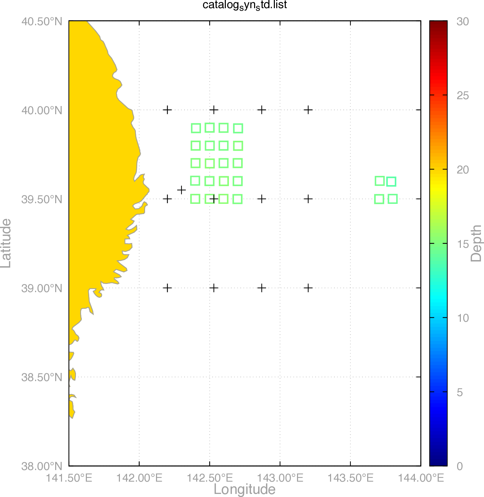

@import "style.css"

# xTreLoc Demo (Feb. 26th, 2025)

## 実行環境

本ツールはJava環境下で実行可能であり, 付属の`run_demo.bash`を実行するとシンセティックテストが実行される. なお, 結果の描画にGnuplotを必要とする. 

## ディレクトリ構成

`demo`ディレクトリ内の以下のファイルが必要である. 加えて, 海岸線データ[world_10m.txt](https://gnuplotting.org/plotting-the-world-revisited/index.html)を取得しておく必要がある.

```sh
demo/
├── catalog_ground_truth.list
├── config.json
├── docx
│   ├── catalog_ground_truth.png
│   ├── catalog_syn.png
│   ├── catalog_syn_std.png
│   ├── catalog_syn_trd.png
│   ├── demo_jp.md
│   ├── demo_jp.pdf (本資料)
│   ├── kdist.png
│   └── style.css
├── map_njt.plt
├── run_demo.bash
├── station.tbl
├── sumdat.py
└── xtreloc
```

<div style="page-break-after: always;"></div>


## 各種モード

xTreLocは以下のコマンドにより実行される. ここでは, それを保存した`xtreloc`コマンドを実行している. 

```bash
java -jar path/to/target/xtreloc-1.0-SNAPSHOT-jar-with-dependencies.jar <mode>
```

ここで, `mode`は以下から選択される:

- **GRD**: フォーカスドランダムサーチにより, 走時差の残差を最小とするグリッドを返す. STDモードの前に実行されるべきである. 

- **STD**: Station-pair Double Difference法を用いた個々のイベントについての震源決定. Fortranで書かれた`hypoEcc` (Ide, 2010; Ohta et al., 2019) のjavaへの移植版であるが, `delaz4.f`などの軽微なバグを修正済み. TRDモードの前に実行されるべきである. 

- **CLS**: 空間クラスタリングによって震源のネットワークを構成し, 走時差についてイベント間の差分を計算する. `hypoDD` (Waldhauser & Ellsworth, 2000) における`ph2dt`と同等の役割であり, TRDモードの前に実行する必要がある.

- **TRD**: Guo & Zhang (2016) によるTriple Difference法を用いた相対震源再決定.

- **SYN**: 震源決定モード (GRD, STD & TRD) に直接流せるシンセティックデータを作成する.

- **MAP**: 非常に簡易的に震源分布をマッピングする. <u>緯度経度の縮尺は正確ではない.</u>

モードを選択しない場合, 以下のhelpが表示される.

```txt
Usage: java -jar path/to/target/xtreloc-1.0-SNAPSHOT-jar-with-dependencies.jar <mode>

Modes:
  GRD    - Location by grid search
  STD    - Location by Station-pair DD
  CLS    - Spatial clustering & create triple-diff
  TRD    - Re-location by Triple Difference
  SYN    - Create dat files for synthetic test
  MAP    - View location results on map
```

<div style="page-break-after: always;"></div>

## シンセティックテスト

ここでは簡易的に`run_demo.bash`内の実行内容を述べる. 

シンセティックテストにおける正解値は`catalog_ground_truth.list`内に記載されている. catalogファイルはスペース区切りで以下の要素を記述する:

- (String) イベント時刻: 震源決定には直接使用されない (e.g., 2000-01-01T00:00:00)
- (Double) 緯度: °Nを正とする, 10進数表記 (e.g., 39.5)
- (Double) 経度: °Eを正とする, 10進数表記 (e.g., 142.4)
- (Double) 深さ: km単位で, 下向きを正とする (e.g., 5)
- (Double) 緯度方向の決定誤差: km単位であり, 震源決定には直接使用されない
- (Double) 経度方向の決定誤差: km単位であり, 震源決定には直接使用されない
- (Double) 深さ方向の決定誤差: km単位であり, 震源決定には直接使用されない
- (Double) RMS走時差残差: 単位は秒であり, 震源決定には直接使用されない
- (String) 検測ファイルのパス: 任意のディレクトリと, イベント時刻をyymmdd.HHMMSSフォーマットで表記したファイル名から構成される (e.g., Jan. 1st, 2000の場合, dat/000101.000000)
- (String) イベント種別:
    - SYN: SYNモードで生成されたイベント
    - GRD: GRDモードで決定されたイベント
    - STD: STDモードで決定されたイベント
    - TRD: TRDモードで決定されたイベント
    - ERR: 震源決定中にエラーが生じたイベント (airquakeなど)
    - REF: リファレンスとして固定されるイベント (CLS, TRDモードにおいて参照される)

これらのデータについて, `station.tbl`内の観測点からの理論走時を用いてシンセティックデータが作成される. 観測点テーブルはスペースで区切られ, 以下の要素からなる:

- (String) 観測点名
- (Double) 緯度: °Nを正とする, 10進数表記
- (Double) 経度: °Eを正とする, 10進数表記
- (Double) 深さ: km単位で, 下向きを正とする. 海底地震計 (OBS) の場合に値は正である. 
- (Double) P波の観測点補正値: 理論値に足される補正値 (秒)
- (Double) S波の観測点補正値: 理論値に足される補正値 (秒)

<div style="page-break-after: always;"></div>

まずは正解値をplotする **(ただしこれは簡易的な描画であり, 必ずしも縮尺は正確でない)**.

```bash
gnuplot -e "filename='catalog_ground_truth.list'" map_njt.plt
```


この`catalog_ground_truth.list`内の9列目に記載されたパス先のディレクトリを用意し, データを作成する.

```bash
mkdir -p dat-SYN
./xtreloc SYN
```

結果を`sumdat.py`によりカタログ化し, Gnuplotで結果を描画する.

```bash
python3 sumdat.py -d dat-SYN
mv catalog.list catalog_syn.list
gnuplot -e "filename='catalog_syn.list'" map_njt.plt
```

パータベーションが加わった分布は`catalog_syn.pdf`として出力される.


このデータに対してSTDモードで震源を決定すると, 結果は`dat-SYN_STD`に出力される. 

```bash
./xtreloc STD
```

同様にカタログ化・描画を行う.

```bash
python3 sumdat.py -d dat-SYN_STD
mv catalog.list catalog_syn_std.list
gnuplot -e "filename='catalog_syn_std.list'" map_njt.plt
```

観測点から外れた震源 (143.50°E-144°E) を除き, 格子状の分布を回復できている.

 station_pair_dd" width=50%>

続いて, Triple Difference法についても同様のテストを行う. その準備として, クラスタリングとTriple Differenceの計算を実行する. 

```bash
./xtreloc CLS
```

この時, `config.json`内の`catalogFile`の11列目はクラスタ番号と認識され, ここにint型で読み込み可能な数値が記載されている場合はそのクラスタを使用する. **ただし, クラスタ番号は0から始まる連番であり, -1はクラスタに分類されないイベントに対応する**. 11列目が空の場合, `minPts`と`eps`をパラメータとするDBSCANを用いたクラスタリングが実行される. なお, `eps`が負の場合にはk-distance graphとエルボー法によって`eps`が自動で推定される. 

```json
"CLS": {
    "minPts": 10,
    "eps": -1,
    "catalogFile": "catalog_syn.list"
},
```

`eps`を自動で推定する場合, 以下のようなk-distance graphが出力される.


CLSモードは, `triple_diff_<cid>.csv`を出力するが, これはhypoDDにおける`dt.ct`に対応するファイルである. これを用いて相対震源決定を行う. 

```bash
./xtreloc TRD
gnuplot -e "filename='catalog_syn_TRD.list'" map_njt.plt
```

震源は以下のように決定される. 観測点から外れた, 143.50°E-144°Eに分布する4つの震源についてはクラスタ化されていない (`catalogFile`における11列目のcid=-1) ため, 入力 (`dat-SYN`以下のファイル) をそのまま返している. 

 triple_difference" width=50%>
