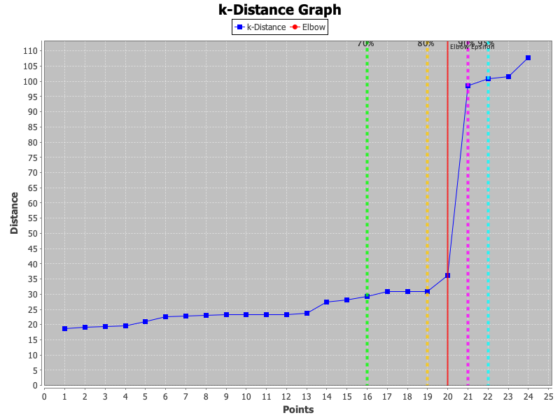
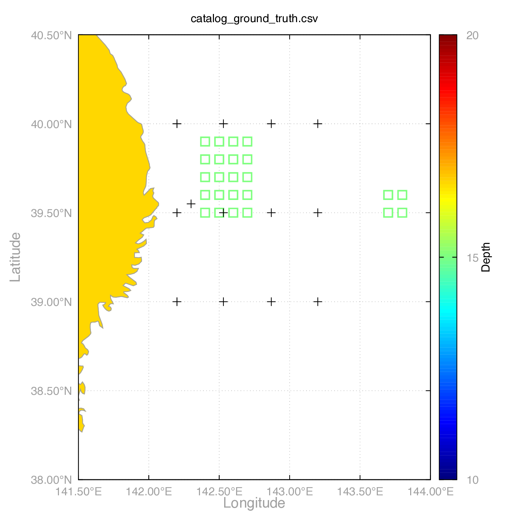
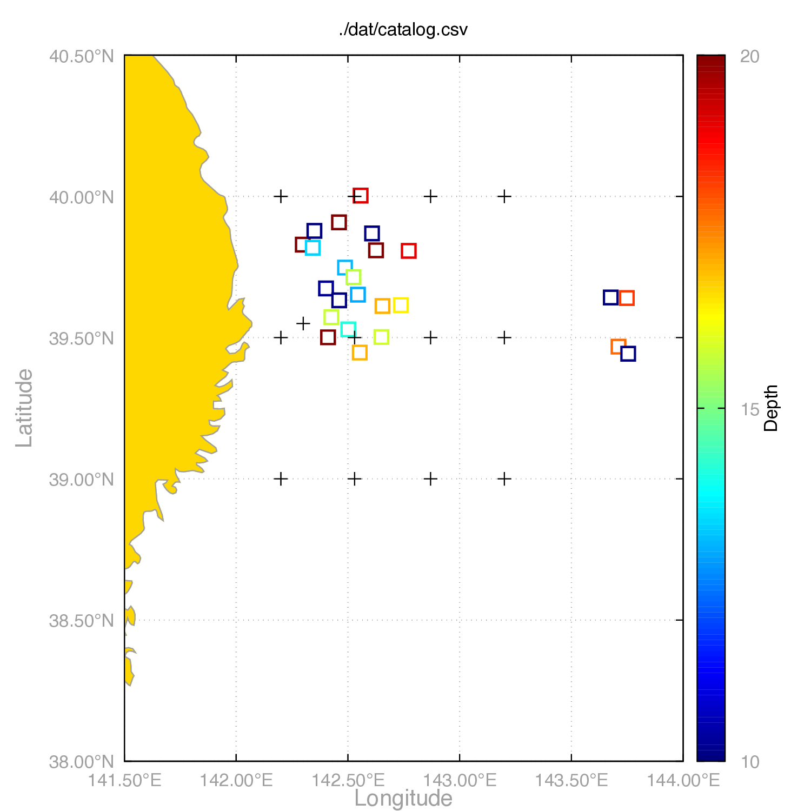
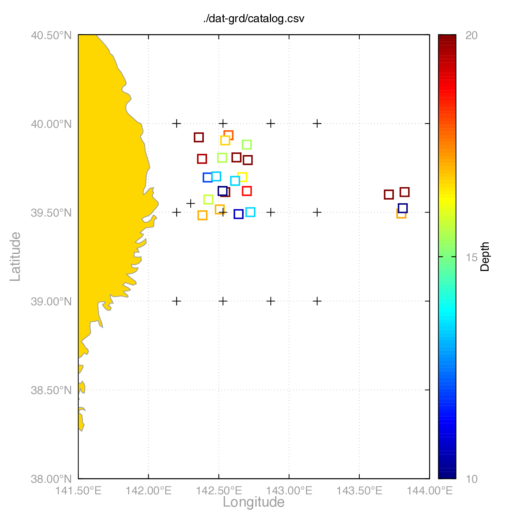
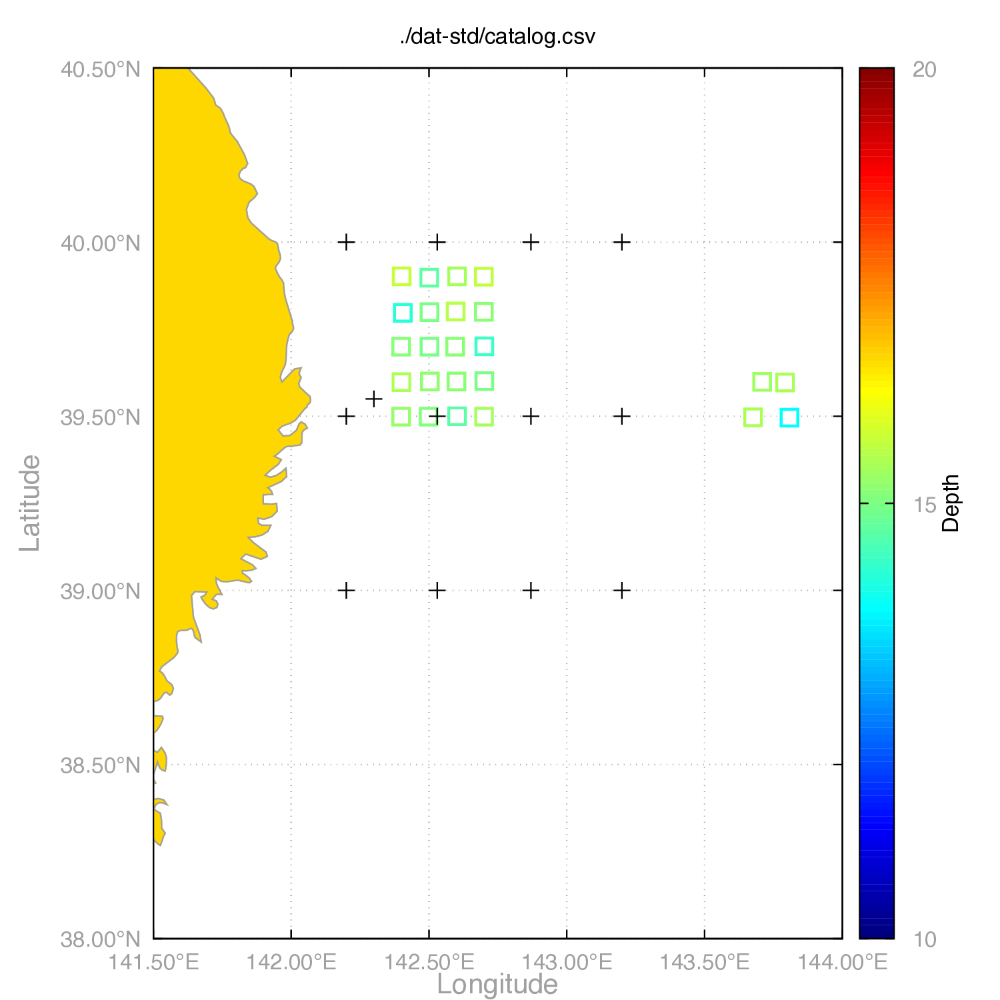
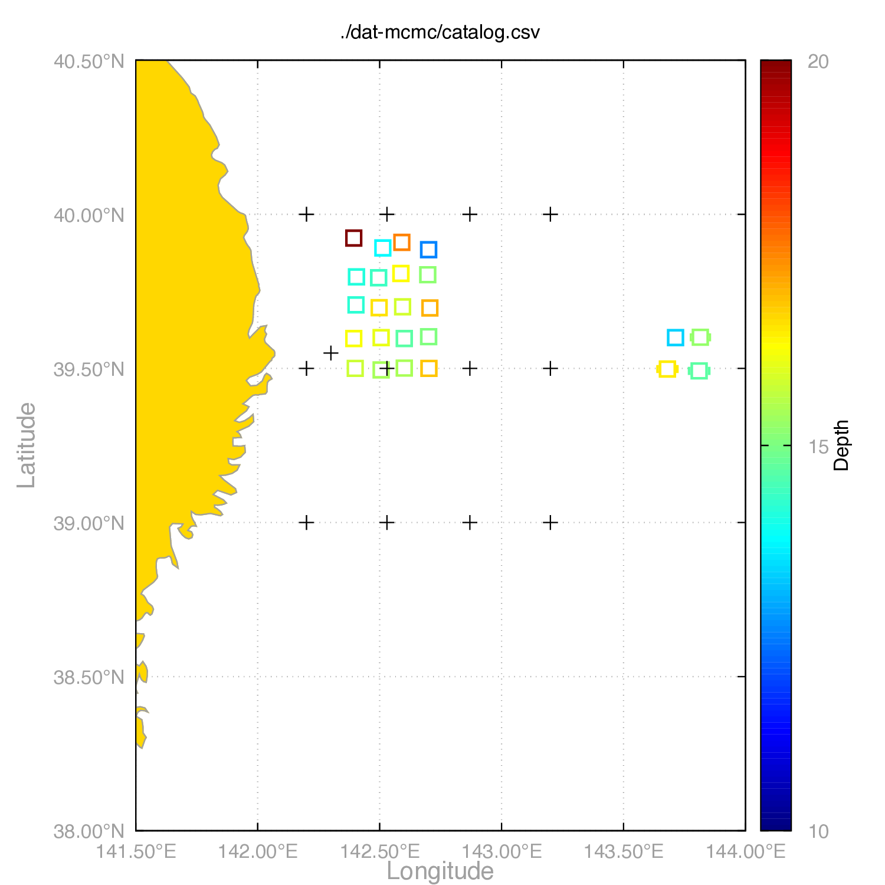
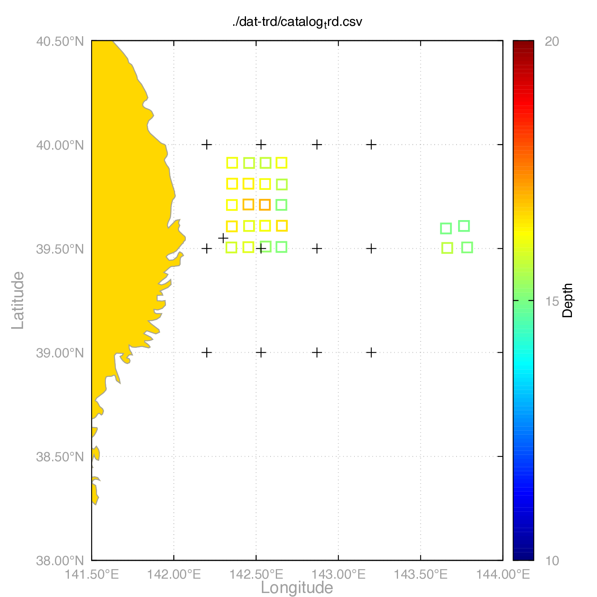
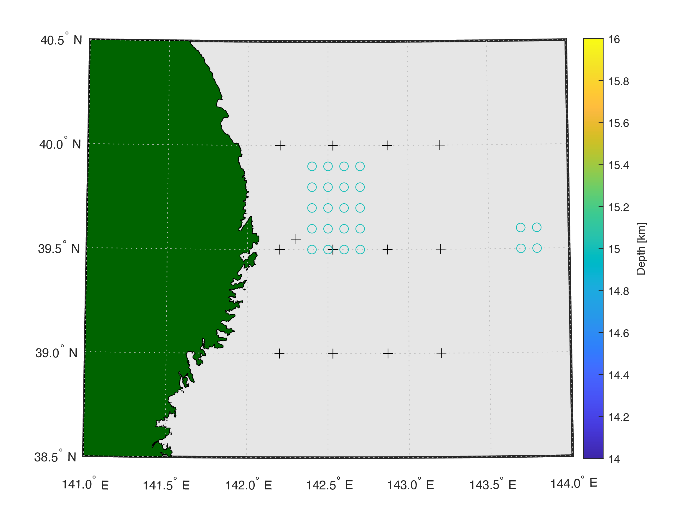
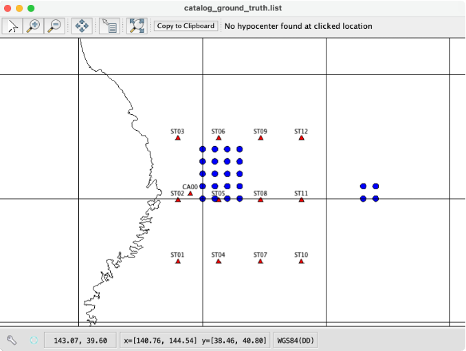

@import "style.css"

# xTreLoc User Manual (English)

## Table of Contents

<!-- @import "[TOC]" {cmd="toc" depthFrom=2 depthTo=3 orderedList=false} -->

<!-- code_chunk_output -->

- [Table of Contents](#table-of-contents)
- [Introduction](#introduction)
- [Installation and Build](#installation-and-build)
  - [Requirements](#requirements)
  - [Building from Source](#building-from-source)
  - [Verifying the Build](#verifying-the-build)
  - [Running JAR Files](#running-jar-files)
- [Data Formats](#data-formats)
  - [Station File Format (station.tbl)](#station-file-format-stationtbl)
  - [Catalog CSV Format](#catalog-csv-format)
  - [Travel Time Difference Data File Format](#travel-time-difference-data-file-format)
- [Configuration (config.json)](#configuration-configjson)
- [GUI Mode](#gui-mode)
  - [Solver Tab and Settings Tab](#solver-tab-and-settings-tab)
  - [Automatic Update Feature](#automatic-update-feature)
  - [Log Files and Settings Files](#log-files-and-settings-files)
  - [Viewer Tab Features](#viewer-tab-features)
  - [Picking Tab](#picking-tab)
- [CLI Mode](#cli-mode)
  - [Starting the CLI](#starting-the-cli)
  - [Help](#help)
- [TUI Mode](#tui-mode)
  - [Building and Running TUI](#building-and-running-tui)
- [Demo Dataset Tutorial](#demo-dataset-tutorial)
  - [Preparation](#preparation)
  - [Demo Dataset Structure](#demo-dataset-structure)
  - [Workflow Overview](#workflow-overview)
  - [Step 1: Synthetic Data Generation](#step-1-synthetic-data-generation)
  - [Step 2: Hypocenter Location](#step-2-hypocenter-location)
  - [Step 3: Hypocenter Relocation](#step-3-hypocenter-relocation)
  - [Step 4: Result Visualization](#step-4-result-visualization)
  - [Output Results](#output-results)
- [Citation of .shp file](#citation-of-shp-file)

<!-- /code_chunk_output -->


---

## Introduction

xTreLoc **determines hypocenters by optimizing travel-time differences obtained from cross-correlation**. It supports multiple location methods:

- **GRD**: Returns a grid that minimizes travel time difference residuals using focused random search. Should be executed before LMO mode.
- **LMO**: Hypocenter location for individual events using Levenberg-Marquardt optimization. A Java port of the Fortran `hypoEcc` (Ide, 2010; Ohta et al., 2019) with minor bug fixes in `delaz4.f`, etc. Should be executed before TRD mode.
- **MCMC**: Hypocenter location using Markov Chain Monte Carlo method. Provides uncertainty estimation.
- **DE (Differential Evolution)**: Hypocenter location using the differential evolution algorithm. A global optimization method that reduces dependence on the initial value while minimizing travel time difference residuals. Like LMO, it optimizes each event individually.
- **TRD**: Relative hypocenter relocation using the Triple Difference method by Guo & Zhang (2016).
- **CLS**: Constructs a network of hypocenters through spatial clustering and calculates differences in travel time differences between events. Equivalent to the role of `ph2dt` in `hypoDD` (Waldhauser & Ellsworth, 2000) and must be executed before TRD mode.
- **SYN**: Creates synthetic data that can be directly used in location modes (GRD, MCMC, LMO, DE, TRD).

The software can be used with three interfaces:

- **GUI Mode**: Interactive graphical user interface
- **CLI Mode**: Command-line interface for batch processing
- **TUI Mode**: Text-based interactive interface (CUI using Lanterna). Run from the terminal by selecting mode and parameters from menus.

**Quick reference:** [Configuration (config.json)](#configuration-configjson) · [CLI Mode](#cli-mode) · [Demo Dataset Tutorial](#demo-dataset-tutorial) (`demo/locating_example/`).

---

## Installation and Build

### Requirements

- **Java 20 or higher** (check with `java -version`)
- Operating system: Windows, macOS, or Linux
- **Gradle** (included in `gradlew` wrapper, or install separately) or **Maven 3.6+**

### Building from Source

#### Using Gradle

```bash
# Clone the repository
git clone https://github.com/KosukeMinamoto/xTreLoc.git
cd xTreLoc

# Build main JAR (launcher; choose GUI/TUI/CLI on startup)
./gradlew build

# Build CLI-only JAR
./gradlew cliJar

# Build TUI-only JAR
./gradlew tuiJar

# Build GUI-only JAR
./gradlew guiJar
```

Built JAR files are placed in `build/libs/`:
- `xTreLoc-1.0-SNAPSHOT.jar` (from `./gradlew build`; launcher that lets you choose GUI/TUI/CLI on startup)
- `xTreLoc-CLI-1.0-SNAPSHOT.jar` (from `./gradlew cliJar`)
- `xTreLoc-TUI-1.0-SNAPSHOT.jar` (from `./gradlew tuiJar`)
- `xTreLoc-GUI-1.0-SNAPSHOT.jar` (from `./gradlew guiJar`)

#### Using Maven

```bash
# Clone the repository
git clone https://github.com/KosukeMinamoto/xTreLoc.git
cd xTreLoc

# Build fat JARs (launcher, GUI, CLI, TUI)
mvn clean package
```

Built JAR files are placed in `target/` (Maven Shade plugin, one `package` run):
- `xTreLoc-1.0-SNAPSHOT.jar` (launcher: choose GUI / TUI / CLI at startup)
- `xTreLoc-GUI-1.0-SNAPSHOT.jar` (GUI)
- `xTreLoc-CLI-1.0-SNAPSHOT.jar` (CLI)
- `xTreLoc-TUI-1.0-SNAPSHOT.jar` (TUI)

**Note:** There are no Maven profiles such as `-Pgui` or `-Pcli` in `pom.xml`. Use Gradle tasks `guiJar`, `cliJar`, or `tuiJar` if you need to build a single variant without invoking the full shade set.

#### Platform-specific build (Linux / Windows / macOS)

JARs are built the same on all platforms. To create **native app-images or installers**, run the following **on the target OS** (JDK 20+ and `./gradlew build` required):

| OS | Gradle task | Description |
|----|--------------|-------------|
| **Linux** | `./gradlew createLinuxApp` | Creates app-image in `build/dist/`. Then `./gradlew createLinuxTarball` for a `.tar.gz`. |
| **Windows** | `./gradlew createWindowsApp` | Creates app-image. `./gradlew createWindowsExe` for .exe installer (requires WiX 3+). |
| **macOS** | `./gradlew createApp` | Creates .app bundle. `./gradlew createDmg` for .dmg installer. |

On Windows use `gradlew.bat` instead of `./gradlew` (e.g. `gradlew.bat createWindowsApp`).

With Maven, `mvn clean package` produces the same JAR set on any OS. Optional profiles `-Plinux`, `-Pwindows`, and `-Pmacos` in `pom.xml` are placeholders and do not change JAR packaging. For native bundles use the Gradle tasks above, or Maven profiles such as `-PcreateApp` / `-PcreateDmg` (see `pom.xml`), or run `jpackage` manually.

### Verifying the Build

After building, verify that JAR files exist:

**Gradle:**
```bash
ls -lh build/libs/*.jar
```

**Maven:**
```bash
ls -lh target/*.jar
```

### Running JAR Files

**GUI Mode:**
```bash
# Using Gradle main JAR (select GUI from menu after startup)
java -jar build/libs/xTreLoc-1.0-SNAPSHOT.jar

# Or using GUI-only JAR (after ./gradlew guiJar)
java -jar build/libs/xTreLoc-GUI-1.0-SNAPSHOT.jar

# Using Maven build
java -jar target/xTreLoc-GUI-1.0-SNAPSHOT.jar
```

**CLI Mode:**
```bash
# config path is optional; default is config.json
java -jar build/libs/xTreLoc-CLI-1.0-SNAPSHOT.jar <MODE> [config.json]

# Using Maven build
java -jar target/xTreLoc-CLI-1.0-SNAPSHOT.jar <MODE> [config.json]
```

---

## Data Formats

### Station File Format (station.tbl)

Space-separated format (six columns; same order as in code: `StationRepository`):
```
code latitude longitude H Pc Sc
```
(`H` is station elevation in **meters**: positive downward, negative above sea level—the value stored internally as station depth and converted to hypocenter depth in km.)

Example:
```
ST01 39.00 142.20 -1000 0.40 0.68
ST02 39.50 142.20 -1670 0.88 1.50
```

**Field Descriptions**:
- **code**: Station identifier
- **latitude**: Latitude in decimal notation (positive for north)
- **longitude**: Longitude in decimal notation (positive for east)
- **H**: Elevation in meters (positive downward, negative above sea level)
- **Pc**: Station correction added to theoretical travel-time difference for P-wave (seconds); **5th column** (after `code lat lon H`)
- **Sc**: Station correction added to theoretical travel-time difference for S-wave (seconds); **6th column**

### Catalog CSV Format

CSV format with header:
```
time,latitude,longitude,depth,xerr,yerr,zerr,rms,file,mode,cid
```

Example:
```
2000-01-01T00:00:00,39.5000,142.4000,15.0000,0.0000,0.0000,0.0000,0.0000,dat/000101.000000.dat,SYN,0
```

**Field Descriptions**:
- **time**: Event time (ISO 8601 format, e.g., 2000-01-01T00:00:00)
- **latitude**: Latitude in decimal notation (positive for north)
- **longitude**: Longitude in decimal notation (positive for east)
- **depth**: Depth (km, positive downward)
- **xerr**: Location error in latitude direction (km)
- **yerr**: Location error in longitude direction (km)
- **zerr**: Location error in depth direction (km)
- **rms**: RMS travel time difference residual (seconds)

- **LMO Mode**: Standard errors from the covariance matrix (Jacobian). Formal uncertainty of the linearized least-squares solution.
- **MCMC Mode**: Standard deviation of the posterior samples (after burn-in). Bayesian uncertainty.
- **DE Mode**: Standard deviation of the final generation population. Spread around the best solution.
- **TRD Mode**: Standard errors from the LSQR solver variance matrix. Formal uncertainty in the triple-difference problem.
- **GRD Mode**: Error estimates are not available; values are stored as 0.

Interpret these according to the mode used.
- **file**: Path to corresponding `.dat` file
- **mode**: Event type (SYN, GRD, LMO, MCMC, DE, TRD, ERR, REF)
- **cid**: Cluster ID (integer, 0 for events not classified into clusters)

**Event Types**:
- **SYN**: Events generated by SYN mode
- **GRD**: Events located by GRD mode
- **LMO**: Events located by LMO mode
- **MCMC**: Events located by MCMC mode
- **DE**: Events located by DE mode
- **TRD**: Events relocated by TRD mode
- **ERR**: Events that encountered errors during location (e.g., airquake)
- **REF**: Reference events that are fixed during TRD relocation (see [Reference Events](#reference-events-ref) section)

### Travel Time Difference Data File Format

Space-separated file managing hypocenter and travel time differences for each event.

**Format**:
- **Line 1**: `latitude longitude depth located_mode`
- **Line 2**: `latitude_error longitude_error depth_error RMS_travel_time_difference_residual`
  - The error estimates (latitude_error, longitude_error, depth_error) have the same meaning as in the catalog CSV (see [Catalog CSV Format](#catalog-csv-format): LMO/MCMC/DE/TRD/GRD).
- **Line 3 and onwards**: `station1 station2 travel_time_difference weight`

**Example**:
```
39.476 142.367 14.015 SYN
0.030 0.030 3.340 -999.000
ST07 ST09 -0.889 1.000
ST03 CA00 -12.975 1.000
ST02 ST09 12.280 1.000
```

**Field Descriptions**:
- **Travel time difference**: Travel time difference for S-wave. Corresponds to the value T_st2 - T_st1, where T_st1 and T_st2 are arrival times at stations st1 and st2, respectively.
- **Weight**: Data quality weight. Compared with `threshold` in `config.json` to determine whether to use the detection value. For example, by inputting the maximum value of the cross-correlation function, when `threshold: 0.6`, only detections with CC>0.6 are used for location.
In SYN mode, all weights are set to `1.0`. After **GRD**, **LMO**, **MCMC**, or **DE** runs, weights are updated from travel-time residuals using `|1 / (residual + ε)|` (see `HypoUtils.residual2weight` in the source). For example, a residual of −2 s gives a weight of `0.5`. The `threshold` in `config.json` filters detections by weight on read (`PointsHandler`). For later steps (LMO, MCMC, DE, CLS, TRD), use `threshold` to control which pairs are kept; the implementation does **not** emit a dedicated error for “fewer than four” observations above threshold—very few usable pairs can still cause numerical or optimization failures.

#### Error estimates in .dat (Line 2)

Same meaning as xerr/yerr/zerr in the catalog CSV: LMO (covariance), MCMC (posterior s.d.), DE (population s.d.), TRD (LSQR), GRD (0). Interpret accordingly.

---

## Configuration (config.json)

The JSON file read by GUI / CLI / TUI uses a top-level layout aligned with the Java `AppConfig` model:

- **`io`**: Per-mode keys (`GRD`, `LMO`, …) with paths such as `datDirectory`, `outDirectory`, and `catalogFile`.
- **`params`**: Solver parameters per mode (e.g. CLS flags `doClustering`, `calcTripleDiff`, `useBinaryFormat` under `params.CLS`).

All paths are relative to the **current working directory** of the process. Do not use a legacy `modes` / `solver`-only layout; follow **`demo/locating_example/config.json`** as the canonical example.

---

## GUI Mode

The GUI consists of four main tabs:
1. Solver tab: Configuration and execution of hypocenter location calculations.
2. Viewer tab: Visualization of hypocenter positions and result analysis.
3. Picking tab: Loading SAC waveform files and picking P/S arrival times.
4. Settings tab: Configuration of application settings.

Launch with the following command:

```bash
java -jar build/libs/xTreLoc-GUI-1.0-SNAPSHOT.jar
```

Or using Gradle:

```bash
./gradlew run
```

### Solver Tab and Settings Tab

- **Solver**: Select the location mode, station file, I/O directories, thresholds, and run batch jobs. Uses the same logical `config.json` structure as the CLI (`io` / `params`).
- **Settings**: Application preferences (fonts, colors, log level, auto-update, etc.) stored under `~/.xtreloc/settings.json`.

### Automatic Update Feature

In GUI mode, the application automatically checks for the latest version on startup. When a new version is available, an update dialog is displayed, allowing you to view release notes and download the update.

**Behavior**: 
- Automatically checks on application startup (when auto-update is enabled)
- Only runs if 24 hours have passed since the last check
- Runs in the background, so it does not interfere with application startup

**Settings**: 
You can enable or disable automatic updates in the Settings tab. It is enabled by default.

**Downloading Updates**: 
You can download updates directly from the update dialog. After download completes, manual installation is required. On macOS, automatic installation of `.dmg` or `.app` files is also supported.

### Log Files and Settings Files

In GUI mode, the following files are created under the user's home directory:

**Settings File**: 
- Location: `~/.xtreloc/settings.json`
- Contents: Font settings, symbol size, color palette, log level, log history lines, auto-update settings, etc.

**Log File**: 
- Location: `~/.xtreloc/xtreloc.log`
- Contents: Application execution logs, error messages, debug information, etc.

These files are automatically updated when you change settings in the Settings tab. The log file is useful for troubleshooting and debugging.

### Viewer Tab Features

The Viewer tab provides visualization and analysis of hypocenter location results.

#### Map Display

- **Catalog data loading**: Load catalog CSV files from the "Catalog Data" tab
- **Station data display**: Load and display station files from the "Station Data" tab
- **Shapefile loading**: Load geographic data such as coastlines and trenches from the "Shapefile" tab
- **Interactive operations**: Zoom, pan, and click on the map to view detailed information

#### Statistical Visualization

The right side of the Viewer tab provides the following statistical visualization features:

- **Hist Tab (Histogram)**: 
  - Display distributions of catalog parameters (latitude, longitude, depth, errors, RMS residuals, etc.) as histograms
  - Select parameters to display using radio buttons
  - Only events visible on the map are included in the histogram

- **Scatter Tab**: 
  - Display relationships between two parameters as scatter plots
  - Useful for statistical analysis of catalog data

#### Residual Plot

Real-time residual convergence plots during Solver tab execution:

- **LMO Mode**: Display residual convergence process for each event
- **MCMC Mode**: Display residual and likelihood convergence
- **DE Mode**: Display residual convergence process for each event
- **TRD Mode**: Display residual convergence for each cluster
- **Split View**: Display multiple events in parallel for comparison
- **Export Function**: Save plots as image files

#### Report Features

The report panel on the left side of the Viewer tab provides the following features:

- **Catalog table display**: Display loaded catalog data in table format
- **Catalog export**: Export catalog rows to CSV (`CsvExporter`).
- **Report export**: Export a `.txt` summary with per-column descriptive statistics (min, max, mean, median, std. dev., quartiles, IQR; numeric columns only—see `ReportPanel.writeReport`).
- **Histogram image export**: Save histograms as image files
- **Directory scan**: Scan directories containing `.dat` files to automatically generate catalogs

#### Travel Time Difference Data Display

Clicking on the "file" column in the catalog table displays the travel time difference data from the corresponding `.dat` file in table format:

- **Station pairs**: Combinations of Station 1 and Station 2
- **Travel time difference**: S-wave travel time difference (seconds)
- **Weight**: Data quality weight value

### Picking Tab

The Picking tab allows you to load SAC format waveform files, pick P/S wave arrival times, and save them as NONLINLOC format `.obs` files.

#### Feature Overview

- **SAC file loading**: Select and load SAC files from a directory tree
- **Waveform display**: Display waveforms from multiple stations simultaneously
- **Filtering**: Apply bandpass filters to process waveforms. On waveform load, the code uses **1–16 Hz** by default (`WaveformPickingPanel`). The high-cut text field may show a different initial value; click **Update Filter** so the displayed range matches the frequencies applied to the data.
- **Picking operations**: 
  - Left click: Pick P-wave arrival time
  - Right click: Pick S-wave arrival time
  - Middle click: Show context menu (remove picks, etc.)
- **Zoom display**: Expand portions of waveforms for detailed picking
- **Station file support**: Automatically configure station name and channel correspondence by loading `station.tbl` files

#### Usage

1. **Select input directory**: Click "Input Directory" button to select a directory containing SAC files
2. **Select station file** (optional): Click "Station File" button to select a `station.tbl` file
3. **Load waveforms**: Select waveform files from the directory tree or file list
4. **Filter settings**: Change frequency filter range if necessary and click "Update Filter" button
5. **Picking**: Click on waveforms with the mouse to pick P/S wave arrival times
6. **Set output directory**: Click "Output Directory" button to select where to save `.obs` files
7. **Save**: Click "Save (.obs format)" button to save picking results

#### Output Format

The saved `.obs` files are in NONLINLOC format and contain the following information:

- Station name
- Channel (component)
- P-wave arrival time
- S-wave arrival time (if picked)

These `.obs` files can be used with external hypocenter location software (e.g., NONLINLOC).

---

## CLI Mode

Batch driver: one process per invocation, mode name required, optional path to the JSON config (default `config.json` in the current directory). I/O paths and solver knobs come from [Configuration (config.json)](#configuration-configjson). Mode roles and workflow are in [Introduction](#introduction) and [Demo Dataset Tutorial](#demo-dataset-tutorial).

### Starting the CLI

```bash
java -jar build/libs/xTreLoc-CLI-1.0-SNAPSHOT.jar <MODE> [config.json]
```

With Maven, use `target/xTreLoc-CLI-1.0-SNAPSHOT.jar` instead of `build/libs/…`.

**Gradle:**

```bash
./gradlew runCLI -PcliArgs="<MODE> [config.json]"
```

Example: `./gradlew runCLI -PcliArgs="GRD demo/locating_example/config.json"`

- `<MODE>`: `GRD`, `LMO`, `MCMC`, `DE`, `CLS`, `TRD`, or `SYN`.

### Help

```bash
java -jar build/libs/xTreLoc-CLI-1.0-SNAPSHOT.jar --help
```

`-h` / `--help` prints usage and exits. With **no arguments**, behavior depends on whether stdin looks interactive (see `XTreLocCLI`): either an interactive prompt or usage text.

---

## TUI Mode

The TUI (Text User Interface) is a text-based interactive interface that runs in the terminal. It uses the Lanterna library to provide a CUI where you can select a location mode (GRD, LMO, MCMC, DE, TRD, CLS, SYN) from a menu and enter parameters interactively before running. It is suitable when the GUI is not available (e.g. SSH sessions or lightweight execution) and you want more flexibility than batch CLI runs to try different parameters.

### Building and Running TUI

**Build TUI-only JAR (Gradle):**

```bash
./gradlew tuiJar
```

After building, `build/libs/xTreLoc-TUI-1.0-SNAPSHOT.jar` is created.

**Run TUI:**

```bash
java -jar build/libs/xTreLoc-TUI-1.0-SNAPSHOT.jar [config.json]
```

Or run directly with Gradle:

```bash
./gradlew runTUI -PtuiArgs="[config.json]"
```

- `[config.json]`: Path to the configuration file (optional; you can enter it after startup or set it from the menu).

After starting the TUI, select a mode from the on-screen menu and edit parameters as needed before running. You can open a log window to view detailed solver logs: press **L** or use the "Show Log Window" button.

---

## Demo Dataset Tutorial

This tutorial explains how to use xTreLoc with the sample data in **`demo/locating_example/`**.

**Important**: Run commands from the **project root** (directory containing `demo/`) when using a config path like `demo/locating_example/config.json`. Paths in the config are relative to the **current working directory**. You can also run from `demo/locating_example/` with `config.json` in that directory.

### Preparation

- Java 20 or higher and built JARs ([Installation and Build](#installation-and-build))
- **Working directory**: For the CLI examples below, use **`demo/locating_example/`** as the current directory and pass `config.json` so relative paths in the config resolve as intended (see the note at the start of this section).
- Sample inputs there: `catalog_ground_truth.csv`, `station.tbl`
- Optional: Gnuplot, MATLAB, Python, or GMT for [Step 4: Result Visualization](#step-4-result-visualization)

See [Configuration (config.json)](#configuration-configjson); **`demo/locating_example/config.json`** is the reference layout.

### Demo Dataset Structure

The demo lives under **`demo/locating_example/`**. Create the output directory if needed:

```sh
mkdir -p demo/locating_example/dat
```

```
demo/locating_example/
├── catalog_ground_truth.csv  # Ground truth catalog for SYN mode
├── station.tbl               # Station file
├── config.json               # Config with io & params (see above)
├── utils/
│   ├── map_njt.plt           # Gnuplot script
│   ├── map_njt.m             # MATLAB script
│   ├── map_njt.py            # Python script
│   └── map_njt.sh            # GMT script
└── dat/                      # Input .dat files (generated by SYN mode)
```

### Workflow Overview

```
Step 1: SYN → .dat files
  ↓
Step 2: GRD+LMO or MCMC → catalog.csv
  ↓
Step 3: CLS → clustered catalog + triple_diff_*.bin, then TRD → relocated catalog
  ↓
Step 4: Visualization (Gnuplot / MATLAB / Python / GMT or GUI)
```

Mode summaries and caveats (e.g. TRD input quality, bootstrap not implemented) are in [Introduction](#introduction).

### Step 1: Synthetic Data Generation

**Purpose**: Create synthetic travel time difference data from a ground truth catalog.

**Using GUI**:
1. Launch the application: `java -jar build/libs/xTreLoc-GUI-1.0-SNAPSHOT.jar`
2. Navigate to the "solver" tab
3. Select mode: **SYN**
4. Settings:
   - **Catalog file**: `./demo/catalog_ground_truth.csv`
   - **Output directory**: `./demo/dat`
   - **Parameters**:
     - Random seed: Seed value (Default: 100)
     - Phase error (phsErr): Perturbation applied to travel time differences (seconds) (Default: 0.1)
     - Location error (locErr): Perturbation applied to hypocenter positions (deg) (Default: 0.03)
     - Minimum selection rate: <u>Minimum</u> number of travel time difference data to be selected (Default: 0.2)
     - Maximum selection rate: <u>Maximum</u> number of travel time difference data to be selected (Default: 0.4)
   Note that `phsErr` and `locErr` values correspond to the standard deviation of a Gaussian distribution. The maximum/minimum selection rates determine what proportion of travel time difference data to use from the possible station pairs (nC2, where n is the number of stations).
5. Click "▶ Execute"

**Using CLI**:

```bash
java -jar build/libs/xTreLoc-CLI-1.0-SNAPSHOT.jar SYN config.json
```

- `phsErr`: Perturbation applied to travel time differences (Default: 0.1 seconds)
- `locErr`: Perturbation applied to hypocenter (Default: horizontal 0.03 degrees, depth 3 km)
- `minSelectRate, maxSelectRate`: Range of number of detections randomly selected (Default: 20-40%)

### Step 2: Hypocenter Location

#### Option A: GRD & LMO

Determine hypocenter positions using LMO method after focused random search.

**Using GUI**:
1. Select mode: **GRD**
1. Settings:
   - **Input directory**: `./demo/dat`
   - **Output directory**: `./demo/dat-grd` (must exist beforehand)
   - **Parameters**:
     - Parallelization (numJobs): Number of jobs in parallel computation (>1)
     - Weight Threshold (threshold): Weight value screening (0 means all travel time data are used)
     - Maximum Depth: Depth limit to be explored. On the other hand, the shallow limit is the depth of the deepest station.
     - Total Grids: Total number of grids to explore (Default: 300)
     - Focus Grids: Number of steps to narrow the region (Default: 3)
     For example, in the above example, 100 (=300/3) grids are randomly placed and explored in 3 rounds while narrowing the target range (i.e., scatter 100 grids in the region surrounding the station range, identify point $p_1$ with minimum residual. Next, scatter 100 points around $p_1$, identify the best point $p_2$. Similarly, select 100 points in a finer region around $p_2$ and take the best $p_3$ as the solution.)
1. Click "▶ Execute"
1. Select mode: **LMO**
1. Settings:
   - **Input directory**: `./demo/dat-grd`
   - **Output directory**: `./demo/dat-lmo` (must exist beforehand)
   - **Parameters**:
     - Parallelization (numJobs): Number of jobs in parallel computation (>1)
     - Weight Threshold (threshold): Weight value screening (0 means all travel time data are used)
     - Maximum Depth: Depth limit to be explored. On the other hand, the shallow limit is the depth of the deepest station.
     - LM Initial Step Bound (initialStepBoundFactor): 100
     - LM Cost Relative Tolerance (costRelativeTolerance): 1e-6
     - LM Parameter Relative Tolerance (parRelativeTolerance): 1e-6
     - LM Orthogonal Tolerance (orthoTolerance): 1e-6
     - LM Max Evaluations (maxEvaluations): 1000
     - LM Max Iterations (maxIterations): 1000
     Changes to LM method parameters are generally not recommended.

1. Click "▶ Execute"

**Using CLI**:
```bash
mkdir -p demo/dat-grd
java -jar build/libs/xTreLoc-CLI-1.0-SNAPSHOT.jar GRD config.json
mkdir -p demo/dat-lmo
java -jar build/libs/xTreLoc-CLI-1.0-SNAPSHOT.jar LMO config.json
```

#### Option B: MCMC

Determine hypocenter positions using Markov Chain Monte Carlo method.

**Using GUI**:
1. Select mode: **MCMC**
2. Settings:
   - **Input directory**: `./demo/dat`
   - **Output directory**: `./demo/dat-mcmc` (must exist beforehand)
   - **Parameters**:
     - Parallelization (numJobs): Number of jobs in parallel computation (>1)
     - Weight Threshold (threshold): Weight value screening (0 means all travel time data are used)
     - Maximum Depth: Depth limit to be explored. On the other hand, the shallow limit is the depth of the deepest station.
     - Sample Count: Number of samples (Default: 1000)
     - Burn-in Period: Burn-in (Default: 200)
     - Step Size: Step size (Default: 0.1)
     - Depth Step Size: Step size in depth direction (Default: 1.0)
     - Temperature Parameter: (Default: 1.0)
3. Click "▶ Execute"

**Using CLI**:

```bash
mkdir -p ./demo/dat-mcmc
java -jar build/libs/xTreLoc-CLI-1.0-SNAPSHOT.jar MCMC config.json
```

### Step 3: Hypocenter Relocation

CLS mode clustering and calculation of travel time difference differences between hypocenter pairs. In this example, files under `dat` generated by SYN mode are used for accuracy verification, but it is strongly recommended to input hypocenters determined by GRD & LMO or MCMC from Step 2 in general.

**Using GUI**:
1. Select mode: **CLS**
2. Settings:
   - **Catalog file**: `./demo/dat/catalog.csv` (or `dat-lmo`, `dat-mcmc`)
   - **Output directory**: `./demo/dat-cls` (must exist beforehand)
   - **Parameters**:
     - Minimum points: Minimum number of points per cluster (3)
     - Epsilon (km): Cluster radius (30.0)
     - Weight Threshold (threshold): Weight value screening
     - Data Inclusion Rate (optional): When epsilon value is negative, automatic estimation using K-distance graph is performed. In this case, input what proportion of events to include relative to the total number of events when setting epsilon. If not set, automatic estimation is performed using the elbow method.
     - RMS Threshold (optional): Threshold for travel time difference in dat files (seconds). Events with travel time residuals exceeding this value are not used for clustering.
     - Location Error Threshold (optional): Threshold for horizontal hypocenter location accuracy in dat files (km). Events with errors exceeding this value are not used for clustering.

3. Click "▶ Execute"

**K-Distance Graph** (for epsilon estimation):


**Using CLI**:
```bash
java -jar build/libs/xTreLoc-CLI-1.0-SNAPSHOT.jar CLS config.json
```

**Note**: Cluster IDs start from 1 as consecutive numbers, and 0 corresponds to events not classified into clusters. If integer values are written in the 11th column (cid) of the catalog file, those cluster IDs are used (only triple difference data calculation is executed, so this is used when clustering is performed beforehand using a different method). If cluster numbers are not assigned and the corresponding column is blank, DBSCAN clustering is executed with `minPts` and `eps` as parameters. However, if `eps` is negative, clustering is performed with `eps` automatically estimated by k-distance graph (and elbow method if Data Inclusion Rate is not specified).
CLS mode outputs files corresponding to `dt.ct` in `hypoDD`, which are `triple_diff_<cid>.bin` (binary format). These are used for relative hypocenter location.

**Using GUI**:
1. Select mode: **TRD**
2. Settings:
   - **Catalog file**: `./demo/dat-cls/catalog.csv` (or other catalog)
   - **Input directory**: `./demo/dat-cls` (directory containing triple difference binary files)
   - **Output directory**: `./demo/dat-trd` (must exist beforehand)
   - **Parameters**:
     - Parallelization (numJobs): Number of jobs in parallel computation (>1)
     - Weight Threshold (threshold): Weight value screening (0 means all travel time data are used)
     - Maximum Depth: Depth limit to be explored. On the other hand, the shallow limit is the depth of the deepest station. <u>Unlike GRD, LMO, MCMC, and DE modes, if updated beyond this depth (or shallower than stations), it is judged as a location failure and an Err tag is assigned.</u>
     - Iteration Count (iterNum): Number of iterations in each step (e.g., 10,10)
     - Distance Threshold (distKm): Distance limit between events in each step (e.g., 50,20)
     - Damping Factor (dampFact): Damping coefficient in each step (e.g., 0,1)
     Iteration Count, Distance Threshold, and Damping Factor must be given as lists. In the above example, in the first step, a network is constructed with events within 50 km, and 10 iterations are performed with Damping Factor of 0. In the next step, similarly, 10 iterations are performed with Damping Factor=1 for events within 20 km. Therefore, the number of elements in these lists must be the same.
     - **Reference events (REF)**: Optional fixed anchors in TRD—see [Reference Events (REF)](#reference-events-ref).
     - **LSQR** (`atol`, `btol`, `conlim`, `iter_lim`, `showLSQR`): Internal triple-difference solver controls (defaults typically `1e-6` / `1e-6` / `1e8` / `1000` / `true`). Change only if you need to tune convergence.

3. Click "▶ Execute"

**Using CLI**:
```bash
mkdir -p demo/dat-trd
java -jar build/libs/xTreLoc-CLI-1.0-SNAPSHOT.jar TRD config.json
```

#### Reference Events (REF)

Reference events (REF) are fixed anchor points used during TRD relocation. They provide absolute positioning while maintaining relative accuracy between target events.

##### When to Use REF Events

REF events are useful in the following scenarios:

1. **Well-located events available**: When you have events with high-quality locations from independent methods (e.g., well-constrained earthquakes with good station coverage)
2. **Absolute positioning needed**: When you need to maintain absolute geographic positions while improving relative locations
3. **Accuracy validation**: When testing relocation accuracy against known ground truth positions

##### How to Create REF Events

**Method 1: Manual creation in catalog CSV**

Edit your catalog CSV file and set the `mode` column to "REF" for events you want to use as references:

```csv
time,latitude,longitude,depth,xerr,yerr,zerr,rms,file,mode,cid
2000-01-01T00:00:00,39.5000,142.4000,15.0000,0.0000,0.0000,0.0000,0.0000,dat/000101.000000.dat,REF,1
```

**Method 2: Using SYN mode**

In your ground truth catalog for SYN mode, set the event type to "REF". These events will be generated without location perturbation:

```csv
time,latitude,longitude,depth,xerr,yerr,zerr,rms,file,mode,cid
2000-01-01T00:00:00,39.5000,142.4000,15.0000,0.0000,0.0000,0.0000,0.0000,dat/ref_event.dat,REF,1
```

##### Behavior in TRD Mode

- REF events are **excluded from relocation** - their positions remain fixed
- REF events **participate in triple difference calculations** - they help constrain the relative positions of target events
- The number of REF events in each cluster is reported in the log
- Target events are relocated relative to REF events, maintaining absolute positioning

**Example**: If you have 10 events in a cluster with 2 REF events:
- 2 REF events: positions fixed
- 8 target events: positions updated during relocation
- All 10 events participate in triple difference calculations

### Step 4: Result Visualization

#### Gnuplot

Simple visualization of catalog results is possible using the provided Gnuplot script `map_njt.plt`.

**Usage**:
1. Navigate to the `demo/` directory:
   ```bash
   cd demo
   ```
2. Edit `map_njt.plt` and set the `filename_csv` variable to the catalog file:
   ```gnuplot
   filename_csv = "dat-lmo/catalog.csv"
   ```
3. Run gnuplot:
   ```bash
   gnuplot map_njt.plt
   ```
4. PDF is automatically generated.

**Example Outputs**:
- Ground truth: 

- Perturbed hypocenters: 

- GRD results: 

- GRD&LMO results: 

- MCMC results: 

- TRD results: 

#### MATLAB

Maps can also be created using the provided MATLAB script `map_njt.m`.

**Usage**:
1. Edit `map_njt.m` and set the catalog file:
   ```matlab
   catalog_file = "demo/dat-lmo/catalog.csv";
   ```
1. Run MATLAB:
   ```matlab
   map_njt
   ```

**Example Output**: 

#### Python

Maps can be created using the provided Python script `map_njt.py`. This script uses Cartopy and Matplotlib, making it easy to customize.

**Requirements**: 
- Python 3.6 or higher
- Required packages: `pandas`, `numpy`, `matplotlib`, `cartopy`

**Installation**: 
```bash
pip install pandas numpy matplotlib cartopy
```

**Usage**: 
1. Navigate to the `demo/` directory:
   ```bash
   cd demo
   ```
2. Specify catalog file, station file, and output file via command-line arguments:
   ```bash
   python3 map_njt.py --catalog ./dat-lmo/catalog.csv --station ./station.tbl --output catalog_lmo.pdf
   ```
3. Or run with default settings:
   ```bash
   python3 map_njt.py
   ```

**Options**: 
- `--catalog`: Path to catalog CSV file (default: `./catalog_ground_truth.csv`)
- `--station`: Path to station file (default: `./station.tbl`)
- `--output`: Output PDF filename (default: `catalog_map.pdf`)
- `--lat-range`: Latitude range (default: `38.0 40.5`)
- `--lon-range`: Longitude range (default: `141.5 144.0`)
- `--depth-range`: Depth range for colorbar (default: `10 20`)

**Features**: 
- Geographic projection using Cartopy
- Automatic error bar display
- Custom colormap (equivalent to Gnuplot palette)
- Automatic drawing of coastlines, land, and ocean

#### GMT (Generic Mapping Tools)

Maps can be created using the provided GMT script `map_njt.sh`. GMT is suitable for high-quality map creation.

**Requirements**: 
- GMT (Generic Mapping Tools) version 6 or later
- `awk` command

**Installation**: 
```bash
# macOS
brew install gmt

# Linux (Ubuntu/Debian)
sudo apt-get install gmt

# Other systems
# See https://www.generic-mapping-tools.org/download/
```

**Usage**: 
1. Navigate to the `demo/` directory:
   ```bash
   cd demo
   ```
2. Make the script executable (first time only):
   ```bash
   chmod +x map_njt.sh
   ```
3. Specify catalog file, station file, and output file via command-line arguments:
   ```bash
   ./map_njt.sh ./dat-lmo/catalog.csv ./station.tbl catalog_lmo.pdf
   ```
4. Or run with default settings:
   ```bash
   ./map_njt.sh
   ```

**Arguments**: 
- 1st argument: Path to catalog CSV file (default: `./catalog_ground_truth.csv`)
- 2nd argument: Path to station file (default: `./station.tbl`)
- 3rd argument: Output PDF filename (default: `catalog_map.pdf`)

**Features**: 
- High-quality map output
- Automatic error bar display
- Custom colormap (equivalent to Gnuplot palette)
- Automatic coastline drawing
- Automatic cleanup of temporary files

**Customization**: 
You can modify the map extent and depth range by editing the following variables in the script:
```bash
LON_MIN=141.5
LON_MAX=144.0
LAT_MIN=38.0
LAT_MAX=40.5
DEPTH_MIN=10
DEPTH_MAX=20
```

#### Drawing on GUI

Navigate to the "viewer" tab, and in the "Catalog data" tab, click "File selection" to load a catalog file for drawing. By selecting shp files, etc., coastlines and trenches can also be drawn.

**GUI Visualization Example**:


### Output Results

After completing all steps, the following is obtained:

```
demo/locating_example/
├── catalog_ground_truth.csv
├── dat
│   ├── 000101.000000.dat
│   ├── ...
│   └── catalog.csv
├── dat-cls
│   ├── ...
│   ├── catalog.csv
│   ├── triple_diff_1.bin
│   └── triple_diff_2.bin
├── dat-grd
│   ├── ...
│   └── catalog.csv
├── dat-mcmc
│   ├── ...
│   └── catalog.csv
├── dat-lmo
│   ├── ...
│   └── catalog.csv
├── dat-trd
│   ├── ...
│   └── catalog_trd.csv
├── utils/
│   ├── map_njt.m
│   ├── map_njt.plt
│   ├── map_njt.py
│   └── map_njt.sh
└── station.tbl
```

## Citation of .shp file

1. Natural Earth: https://www.naturalearthdata.com/downloads/10m-physical-vectors/10m-coastline/
1. The Geospatial Information Authority of Japan (GSI): https://www.gsi.go.jp/kankyochiri/gm_japan_e.html

---

**Version**: 1.0-SNAPSHOT  
**Last Updated**: 2026

