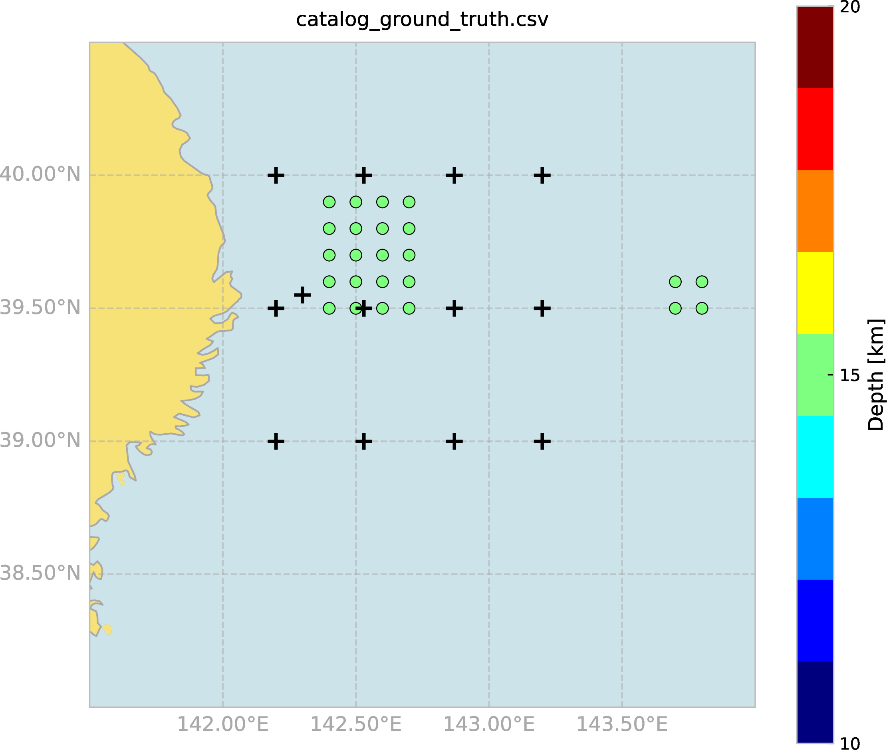

@import "style.css"

# xTreLoc ユーザーマニュアル (日本語版)

## 目次

<!-- @import "[TOC]" {cmd="toc" depthFrom=2 depthTo=3 orderedList=false} -->

<!-- code_chunk_output -->

- [目次](#目次)
- [はじめに](#はじめに)
- [インストールとビルド](#インストールとビルド)
  - [要件](#要件)
  - [ソースからのビルド](#ソースからのビルド)
  - [ビルドの確認](#ビルドの確認)
  - [JARファイルの実行](#jarファイルの実行)
- [データフォーマット](#データフォーマット)
  - [観測点ファイル形式 (station.tbl)](#観測点ファイル形式-stationtbl)
  - [カタログCSV形式](#カタログcsv形式)
  - [走時差データファイル形式](#走時差データファイル形式)
- [GUIモード](#guiモード)
  - [自動更新機能](#自動更新機能)
  - [ログファイルと設定ファイル](#ログファイルと設定ファイル)
  - [Viewerタブの詳細機能](#viewerタブの詳細機能)
  - [Pickingタブ](#pickingタブ)
- [CLIモード](#cliモード)
  - [CLIモードの起動](#cliモードの起動)
  - [コマンド構文](#コマンド構文)
  - [利用可能なモード](#利用可能なモード)
  - [ヘルプ](#ヘルプ)
- [TUIモード](#tuiモード)
  - [TUIのビルドと起動](#tuiのビルドと起動)
- [デモデータセットチュートリアル](#デモデータセットチュートリアル)
  - [準備](#準備)
  - [デモデータセット構造](#デモデータセット構造)
  - [ワークフロー概要](#ワークフロー概要)
  - [ステップ1: シンセティックデータの生成](#ステップ1-シンセティックデータの生成)
  - [ステップ2: 震源決定](#ステップ2-震源決定)
  - [ステップ3: 震源再決定](#ステップ3-震源再決定)
  - [ステップ4: 結果の可視化](#ステップ4-結果の可視化)
  - [出力結果](#出力結果)
- [Shapeファイル引用元](#shapeファイル引用元)

<!-- /code_chunk_output -->


---

## はじめに

xTreLocは, 複数の震源決定手法をサポートする震源決定ソフトウェアである: 

- **GRD**: フォーカスドランダムサーチにより, 走時差の残差を最小とするグリッドを返す. LMOモードの前に実行することが推奨される. 
- **LMO**: Levenberg-Marquardt最適化を用いた個々のイベントについての震源決定. Fortranで書かれた`hypoEcc` (Ide, 2010; Ohta et al., 2019) のJavaへの移植版であるが, `delaz4.f`などの軽微なバグを修正済み.
- **MCMC**: マルコフ連鎖モンテカルロ法による震源決定. 不確実性の推定を提供する. 
- **DE (Differential Evolution)**: 差分進化法による震源決定. グローバル最適化手法であり, 初期値依存を弱めつつ走時差残差を最小化する. LMOと同様に個々のイベントごとに最適化を行う.
- **TRD**: Guo & Zhang (2016) によるTriple Difference法を用いた相対震源再決定. 
- **CLS**: 空間クラスタリングによって震源のネットワークを構成し, 走時差についてイベント間の差分を計算する. `hypoDD` (Waldhauser & Ellsworth, 2000) における`ph2dt`と同等の役割であり, TRDモードの前に実行する必要がある. 
- **SYN**: 震源決定モード (GRD, MCMC, LMO, DE, TRD) に直接流せるシンセティックデータを作成する. 

本ソフトウェアは3つのインターフェースで使用できる: 

- **GUIモード**: 対話型グラフィカルユーザーインターフェース
- **CLIモード**: バッチ処理用のコマンドラインインターフェース
- **TUIモード**: テキストベースの対話型インターフェース (Lanterna を用いたCUI). ターミナル上でメニューからモードとパラメータを選択して実行する.

---

## インストールとビルド

### 要件

- **Java 20以上** (`java -version`で確認)
- オペレーティングシステム: Windows, macOS, またはLinux
- **Gradle** (`gradlew`ラッパーに含まれているか, 別途インストール) または **Maven 3.6以上**

### ソースからのビルド

#### Gradleを使用

```bash
# リポジトリをクローン
git clone https://github.com/KosukeMinamoto/xTreLoc.git
cd xTreLoc

# メインJARをビルド (起動時にGUI/TUI/CLIを選択)
./gradlew build

# CLI専用JARをビルド
./gradlew cliJar

# TUI専用JARをビルド
./gradlew tuiJar

# GUI専用JARをビルド
./gradlew guiJar
```

ビルドされたJARファイルは`build/libs/`に配置される: 
- `xTreLoc-1.0-SNAPSHOT.jar` (`./gradlew build` で生成. 起動時にGUI/TUI/CLIを選択するランチャー.)
- `xTreLoc-CLI-1.0-SNAPSHOT.jar` (`./gradlew cliJar` で生成)
- `xTreLoc-TUI-1.0-SNAPSHOT.jar` (`./gradlew tuiJar` で生成)
- `xTreLoc-GUI-1.0-SNAPSHOT.jar` (`./gradlew guiJar` で生成)

#### Mavenを使用

```bash
# リポジトリをクローン
git clone https://github.com/KosukeMinamoto/xTreLoc.git
cd xTreLoc

# 両方のJARをビルド
mvn clean package
```

ビルドされたJARファイルは`target/`に配置される: 
- `xTreLoc-GUI-1.0-SNAPSHOT.jar` (GUI版)
- `xTreLoc-CLI-1.0-SNAPSHOT.jar` (CLI版)

**ビルドオプション:**
- GUI版のみビルド: `mvn clean package -Pgui`
- CLI版のみビルド: `mvn clean package -Pcli`

### ビルドの確認

ビルド後, JARファイルが存在することを確認: 

**Gradle:**
```bash
ls -lh build/libs/*.jar
```

**Maven:**
```bash
ls -lh target/*.jar
```

### JARファイルの実行

**GUIモード:**
```bash
# GradleでメインJARをビルドした場合 (起動後メニューでGUIを選択)
java -jar build/libs/xTreLoc-1.0-SNAPSHOT.jar

# またはGUI専用JAR (./gradlew guiJar でビルドした場合)
java -jar build/libs/xTreLoc-GUI-1.0-SNAPSHOT.jar

# Mavenでビルドした場合
java -jar target/xTreLoc-GUI-1.0-SNAPSHOT.jar
```

**CLIモード:**
```bash
# Gradleでビルドした場合
java -jar build/libs/xTreLoc-CLI-1.0-SNAPSHOT.jar <MODE> config.json

# Mavenでビルドした場合
java -jar target/xTreLoc-CLI-1.0-SNAPSHOT.jar <MODE> config.json
```

---

## データフォーマット

### 観測点ファイル形式 (station.tbl)

スペース区切り形式: 
```
station,latitude,longitude,depth,Pc,Sc
```

例: 
```
ST01 39.00 142.20 -1000 0.40 0.68
ST02 39.50 142.20 -1670 0.88 1.50
```

**フィールド説明**: 
- **観測点名**: 観測点識別子
- **緯度**: 10進数表記の緯度 (北を正とする)
- **経度**: 10進数表記の経度 (東を正とする)
- **H**: メートル単位の標高 (下向きを正, 海面上は負)
- **Pc**: 理論走時差に足されるP波の観測点補正値 (秒)
- **Sc**: 理論走時差に足されるS波の観測点補正値 (秒)

### カタログCSV形式

ヘッダー付きCSV形式: 
```
time,latitude,longitude,depth,xerr,yerr,zerr,rms,file,mode,cid
```

例: 
```
2000-01-01T00:00:00,39.5000,142.4000,15.0000,0.0000,0.0000,0.0000,0.0000,dat/000101.000000.dat,SYN,0
```

**フィールド説明**: 
- **time**: イベント時刻 (ISO 8601形式, 例: 2000-01-01T00:00:00)
- **latitude**: 10進数表記の緯度 (北を正とする)
- **longitude**: 10進数表記の経度 (東を正とする)
- **depth**: 深さ (km, 下向きを正とする)
- **xerr**: 緯度方向の決定誤差 (km)
- **yerr**: 経度方向の決定誤差 (km)
- **zerr**: 深さ方向の決定誤差 (km)
- **rms**: RMS走時差残差 (秒)

**誤差推定値について**: 誤差推定値 (xerr, yerr, zerr) の意味は, 震源決定モードによって異なる:
- **GRDモード**: 誤差推定ができないため, 強制的に0を格納.
- **LMOモード**: ヤコビアン行列を用いた共分散行列から計算された標準誤差. 線形化された最小二乗解に基づく形式的な不確実性を表す.
- **MCMCモード**: 事後分布サンプル (バーンイン後) の標準偏差. サンプリングされた分布から得られるベイズ的不確実性推定値を表す.
- **DEモード**: 最終世代の個体群分布の標準偏差. 最良個体周辺の候補解の広がりを表し, 最適化の収束と不確実性を示す.
- **TRDモード**: LSQRソルバーの分散行列から得られる標準誤差. 線形化されたTriple Diff.における形式的な不確実性を表す.

これらの異なる誤差推定値は, 各モードで使用される異なる統計的フレームワークと最適化手法を反映しており, それに応じて解釈する必要がある.
- **file**: 対応する`.dat`ファイルのパス
- **mode**: イベント種別 (SYN, GRD, LMO, MCMC, DE, TRD, ERR, REF)
- **cid**: クラスタID (整数, 0はクラスタに分類されないイベント)

**イベント種別**: 
- **SYN**: SYNモードで生成されたイベント
- **GRD**: GRDモードで決定されたイベント
- **LMO**: LMOモードで決定されたイベント
- **MCMC**: MCMCモードで決定されたイベント
- **DE**: DEモードで決定されたイベント
- **TRD**: TRDモードで再決定されたイベント
- **ERR**: 震源決定中にエラーが生じたイベント (例: airquake)
- **REF**: TRDモードにおいて固定される参照イベント (詳細は[参照イベント (REF)](#参照イベント-ref)セクションを参照)

### 走時差データファイル形式

イベントごとの震源, 走時差を管理するスペース区切りのファイル. 

**形式**: 
- **1行目**: `緯度 経度 深さ 決定されたモード`
- **2行目**: `緯度誤差 経度誤差 深さ誤差 RMS走時差残差`
  - 誤差推定値 (緯度誤差, 経度誤差, 深さ誤差) の意味はモードによって異なります (下記の[誤差推定値](#誤差推定値)セクションを参照)
- **3行目以降**: `観測点1 観測点2 走時差 走時差残差`
 
**例**: 
```
39.476 142.367 14.015 SYN
0.030 0.030 3.340 -999.000
ST07 ST09 -0.889 1.000
ST03 CA00 -12.975 1.000
ST02 ST09 12.280 1.000
```

**フィールド説明**: 
- **走時差**: S波についての走時差. 観測点st1とst2における到達時刻T_st1とT_st2について, T_st2 - T_st1の値に対応する. 
- **重み**: データ品質の重み. `config.json`内の`threshold`と比較され, その検測値を使用するか判断する際に参照される. 例えば, 相互相関関数の最大値を入力することで, `threshold: 0.6`とした場合にはCC>0.6の検測値のみを用いて震源を決定する. 
SYNモードにおいては全て1.0が設定され, GRD, LMO, MCMCモードにおいては走時差の逆数の絶対値が書き込まれる. 例えば残差が-2秒の検測値の重みは`0.5`であり, 次の決定ステップ (LMO, MCMC, CLS, TRD)において許容する残差を`threshold`で管理できる. なおLMOモードにおいては優決定問題として解くため, `threshold`を超える4つ以上の検測値がない場合にはエラーが出力される. 

---

## GUIモード

GUIは4つの主要なタブで構成される:
1. Solverタブ: 震源決定計算の設定と実行. 
2. Viewerタブ: 震源位置の可視化と結果の分析. 
3. Pickingタブ: SAC波形ファイルの読み込みとP/S波到着時刻のピッキング.
4. Settingsタブ: アプリケーション設定の構成. 

以下のコマンドで起動:

```bash
java -jar build/libs/xTreLoc-GUI-1.0-SNAPSHOT.jar
```

またはGradleを使用: 

```bash
./gradlew run
```

### 自動更新機能

GUIモードでは, アプリケーション起動時に自動的に最新バージョンのチェックが行われる. 新しいバージョンが利用可能な場合, 更新ダイアログが表示され, リリースノートの確認やダウンロードが可能である.

**動作**: 
- アプリケーション起動時に自動的にチェック (自動更新が有効な場合)
- 前回のチェックから24時間経過している場合のみ実行
- バックグラウンドで実行されるため, アプリケーションの起動を妨げない

**設定**: 
Settingsタブで自動更新の有効/無効を切り替えることができる. デフォルトでは有効である.

**更新のダウンロード**: 
更新ダイアログから直接ダウンロードでき, ダウンロード完了後は手動でインストールする必要がある. macOSでは`.dmg`や`.app`ファイルの自動インストールにも対応している.

### ログファイルと設定ファイル

GUIモードでは, 以下のファイルがユーザーのホームディレクトリ配下に作成される:

**設定ファイル**: 
- 場所: `~/.xtreloc/settings.json`
- 内容: フォント設定, シンボルサイズ, カラーパレット, ログレベル, ログ履歴行数, 自動更新設定など

**ログファイル**: 
- 場所: `~/.xtreloc/xtreloc.log`
- 内容: アプリケーションの実行ログ, エラーメッセージ, デバッグ情報など

これらのファイルはSettingsタブから設定を変更すると自動的に更新される. ログファイルは問題の診断やデバッグに有用である.

### Viewerタブの詳細機能

Viewerタブでは, 震源決定結果の可視化と分析を行うことができる.

#### マップ表示

- **カタログデータの読み込み**: "Catalog Data"タブでカタログCSVファイルを選択して読み込む
- **観測点データの表示**: "Station Data"タブで観測点ファイルを読み込んで表示
- **Shapefileの読み込み**: "Shapefile"タブで海岸線や海溝などの地理データを読み込んで表示
- **インタラクティブな操作**: マップ上でズーム, パン, クリックによる詳細情報表示が可能

#### 統計的可視化

Viewerタブの右側には以下の統計的可視化機能が利用可能:

- **Histタブ (ヒストグラム)**: 
  - カタログデータの各パラメータ (緯度, 経度, 深さ, 誤差, RMS残差など) の分布をヒストグラムで表示
  - ラジオボタンで表示するパラメータを選択可能
  - マップ上で表示/非表示が設定されたイベントのみを対象として表示

- **Scatterタブ (散布図)**: 
  - 2つのパラメータ間の関係を散布図で表示
  - カタログデータの統計分析に有用

#### 残差プロット (Residual Plot)

Solverタブの実行中に, リアルタイムで残差の収束状況をプロット表示する機能:

- **LMOモード**: 各イベントの残差の収束過程を表示
- **MCMCモード**: 残差と尤度の収束過程を表示
- **DEモード**: 各イベントの残差の収束過程を表示
- **TRDモード**: クラスタごとの残差収束を表示
- **スプリットビュー**: 複数のイベントを並列表示して比較可能
- **エクスポート機能**: プロットを画像ファイルとして保存可能

#### レポート機能

Viewerタブの左側にあるレポートパネルでは以下の機能が利用可能:

- **カタログテーブル表示**: 読み込んだカタログデータをテーブル形式で表示
- **カタログエクスポート**: カタログデータをCSV形式でエクスポート
- **レポートエクスポート**: 統計情報を含むテキストレポートをエクスポート
- **ヒストグラム画像エクスポート**: ヒストグラムを画像ファイルとして保存
- **ディレクトリスキャン**: `.dat`ファイルを含むディレクトリをスキャンしてカタログを自動生成

#### 走時差データ表示

カタログテーブルの"file"列をクリックすると, 対応する`.dat`ファイルの走時差データがテーブル形式で表示される:

- **観測点ペア**: 観測点1と観測点2の組み合わせ
- **走時差**: S波の走時差 (秒)
- **重み**: データ品質の重み値

### Pickingタブ

Pickingタブでは, SAC形式の波形ファイルを読み込んでP/S波の到着時刻をピッキングし, NONLINLOC形式の`.obs`ファイルとして保存することができる.

#### 機能概要

- **SACファイルの読み込み**: ディレクトリツリーからSACファイルを選択して読み込み
- **波形表示**: 複数観測点の波形を同時に表示
- **フィルタリング**: バンドパスフィルタを適用して波形を処理 (デフォルト: 1-16 Hz)
- **ピッキング操作**: 
  - 左クリック: P波到着時刻のピッキング
  - 右クリック: S波到着時刻のピッキング
  - 中クリック: コンテキストメニュー表示 (ピッキングの削除など)
- **ズーム表示**: 波形の一部を拡大表示して詳細なピッキングが可能
- **観測点ファイル対応**: `station.tbl`ファイルを読み込むことで, 観測点名とチャンネルの対応を自動設定

#### 使用方法

1. **入力ディレクトリの選択**: "Input Directory"ボタンでSACファイルを含むディレクトリを選択
2. **観測点ファイルの選択** (オプション): "Station File"ボタンで`station.tbl`ファイルを選択
3. **波形の読み込み**: ディレクトリツリーまたはファイルリストから波形ファイルを選択
4. **フィルタ設定**: 必要に応じて周波数フィルタの範囲を変更し, "Update Filter"ボタンをクリック
5. **ピッキング**: 波形上でマウスクリックしてP/S波の到着時刻をピッキング
6. **出力ディレクトリの設定**: "Output Directory"ボタンで`.obs`ファイルの保存先を選択
7. **保存**: "Save (.obs format)"ボタンをクリックしてピッキング結果を保存

#### 出力形式

保存される`.obs`ファイルはNONLINLOC形式で, 以下の情報が含まれる:

- 観測点名
- チャンネル (コンポーネント)
- P波到着時刻
- S波到着時刻 (ピッキングされた場合)

この`.obs`ファイルは, 外部の震源決定ソフトウェア (例: NONLINLOC) で使用することができる.

---

## CLIモード

### CLIモードの起動

```bash
java -jar xTreLoc-CLI-1.0-SNAPSHOT.jar <MODE> [config.json]
```

またはGradleを使用: 

```bash
./gradlew runCLI -PcliArgs="<MODE> [config.json]"
```

### コマンド構文

```
java -jar xTreLoc-CLI-1.0-SNAPSHOT.jar <MODE> [config.json]
```

- `<MODE>`: GRD, LMO, MCMC, TRD, CLS, またはSYNのいずれか (DEはCLIでは未実装のため, GUIまたはTUIで利用する.)
- `[config.json]`: 設定ファイルのパス (Default: `config.json`)

### 利用可能なモード

各震源決定モードには, 大まかには以下のような特徴がある:
- **GRDモード**: 中程度の速度だが, 大まかな分布の推定や初期震源決定に適する.
- **LMOモード**: 高速に良好な精度を出すが, 初期値依存性が高いため, GRDモードの次に実行することが推奨される.
- **MCMCモード**: 計算に時間を要するが, 良好な決定精度である.
- **TRDモード**: インプットデータの震源決定精度が大きく影響するため, 上記のモードを実行後の再決定手法として用いられる. また一部の解は発散するためにデータ数が減る場合が多い. なお計算が重いため, ブートストラップ法を用いた誤差推定は現時点で未実装である. 

**注**: DE (差分進化) モードはGUIおよびTUIで利用可能である. CLIでは未実装である.

#### GRDモード (グリッドサーチ)

```bash
java -jar xTreLoc-CLI-1.0-SNAPSHOT.jar GRD config.json
```

指定されたディレクトリ内のすべての`.dat`ファイルに対して, フォーカスドランダムサーチを使用したグリッドサーチ震源決定を実行. 

#### LMOモード

```bash
java -jar xTreLoc-CLI-1.0-SNAPSHOT.jar LMO config.json
```

すべての`.dat`ファイルに対してLevenberg-Marquardt最適化を適用.

#### MCMCモード

```bash
java -jar xTreLoc-CLI-1.0-SNAPSHOT.jar MCMC config.json
```

すべての`.dat`ファイルに対してMCMCを用いた震源決定を実行する. 

#### CLSモード

```bash
java -jar xTreLoc-CLI-1.0-SNAPSHOT.jar CLS config.json
```

DBSCANアルゴリズムを使用して, カタログファイルに対して空間クラスタリングを実行し, 「走時差の差」データをバイナリ形式で作成. `hypoDD`の`ph2dt`と同等の機能. 

#### TRDモード

```bash
java -jar xTreLoc-CLI-1.0-SNAPSHOT.jar TRD config.json
```

Guo & Zhang (2016) の方法を使用して, カタログファイルに対してTriple-Difference法を実行. CLSモードによるバイナリファイルが必要.

#### SYNモード

```bash
java -jar xTreLoc-CLI-1.0-SNAPSHOT.jar SYN config.json
```

正解値カタログからdat形式のシンセティックデータを生成. 

### ヘルプ

```bash
java -jar xTreLoc-CLI-1.0-SNAPSHOT.jar --help
```

または

```bash
java -jar xTreLoc-CLI-1.0-SNAPSHOT.jar
```

---

## TUIモード

TUI (Text User Interface) は, ターミナル上で動作するテキストベースの対話型インターフェースである. Lanterna ライブラリを用いたCUIであり, メニューから震源決定モード (GRD, LMO, MCMC, DE, TRD, CLS, SYN) を選択し, パラメータを対話的に入力して実行できる. GUIが利用できない環境 (SSH接続先や軽量な実行) で, CLIのバッチ実行よりも柔軟にパラメータを変えながら試す場合に適する.

### TUIのビルドと起動

**TUI専用JARのビルド (Gradle):**

```bash
./gradlew tuiJar
```

ビルド後, `build/libs/xTreLoc-TUI-1.0-SNAPSHOT.jar` が生成される.

**TUIの起動:**

```bash
java -jar build/libs/xTreLoc-TUI-1.0-SNAPSHOT.jar [config.json]
```

またはGradleから直接実行する場合:

```bash
./gradlew runTUI -PtuiArgs="[config.json]"
```

- `[config.json]`: 設定ファイルのパス (省略時は起動後にパスを入力するか, メニューで設定する).

TUI起動後, 画面上のメニューからモードを選択し, 必要に応じてパラメータを編集して実行する. ログウィンドウは **L** キーまたは「Show Log Window」ボタンで開く. ソルバー実行中の詳細ログを確認できる.

---

## デモデータセットチュートリアル

このチュートリアルでは, `demo/`ディレクトリ内のサンプルデータを使用してxTreLocを使用する手順を説明する.

**重要**: このチュートリアルのすべてのコマンドは, プロジェクトルートディレクトリ（`demo/`フォルダを含むディレクトリ）から実行する必要がある. `config.json`内のパスはこのディレクトリを基準とした相対パス, つまりコマンドを実行する際のカレントディレクトリは, プロジェクトルート（`demo/`の1つ上のディレクトリ）である必要がある.

### 準備

- Java 20以上がインストールされていること
- xTreLoc JARファイルがビルドされていること (GUIおよび/またはCLI)
- **カレントディレクトリ**: プロジェクトルートディレクトリ（`demo/`, `config.json`などを含むディレクトリ）にいることを確認してください
- `demo/`ディレクトリ内のサンプルデータ: 
  - `catalog_ground_truth.csv`: 正解値カタログ
  - `station.tbl`: 観測点ファイル
- Gnuplot (可視化スクリプト用, オプショナル)

- 以下の`config.json`が必要 (CLIモードで実行する場合)
  ```json
  {
      "logLevel": "INFO",
      "numJobs": 4,
      "stationFile": "./demo/station.tbl",
      "taupFile": "prem",
      "hypBottom": 40.0,
      "threshold": 0.0,
      "modes": {
          "GRD": {
              "datDirectory": "./demo/dat",
              "outDirectory": "./demo/dat-grd"
          },
          "LMO": {
              "datDirectory": "./demo/dat",
              "outDirectory": "./demo/dat-std"
          },
          "MCMC": {
              "datDirectory": "./demo/dat",
              "outDirectory": "./demo/dat-mcmc"
          },
          "TRD": {
              "catalogFile": "./demo/dat-cls/catalog.csv",
              "datDirectory": "./demo/dat-cls",
              "outDirectory": "./demo/dat-trd"
          },
          "CLS": {
              "catalogFile": "./demo/dat-cls/catalog.csv",
              "outDirectory": "./demo/dat-cls",
              "minPts": 5,
              "eps": 10.0
          },
          "SYN": {
              "catalogFile": "./demo/catalog_ground_truth.csv",
              "outDirectory": "./demo/dat",
              "randomSeed": 200,
              "phsErr": 0.15,
              "locErr": 0.05,
              "minSelectRate": 0.3,
              "maxSelectRate": 0.5
          }
      },
      "solver": {
          "GRD": {
              "totalGrids": 300,
              "numFocus": 3
          },
          "MCMC": {
              "nSamples": 1000,
              "burnIn": 200,
              "stepSize": 0.1,
              "temperature": 1.0
          },
          "TRD": {
              "iterNum": [10, 10],
              "distKm": [50, 20],
              "dampFact": [0, 1],
              "lsqrAtol": 1e-6,
              "lsqrBtol": 1e-6,
              "lsqrConlim": 1e8,
              "lsqrIterLim": 1000,
              "lsqrShowLog": true
          }
      }
  }
  ```

### デモデータセット構造

```sh
mkdir -p ./demo/dat
```

```
.
├── config.json                    # CLIモードでのみ使用
└── demo/
    ├── catalog_ground_truth.csv   # SYNモード用の正解値カタログ
    ├── station.tbl                # 観測点ファイル
    ├── map_njt.plt                # 描画用のGnuplot Script
    ├── map_njt.m                  # 描画用のMatlab Script
    ├── map_njt.py                 # 描画用のPython Script
    ├── map_njt.sh                 # 描画用のGMT Script
    └── dat/                       # 入力.datファイル
```

### ワークフロー概要

```
ステップ1: SYN → .datファイルの生成
  ↓
ステップ2: GRD+LMO or MCMCによる震源決定手法の実行 → catalog.csvの出力
  ↓
ステップ3: 可視化 → Gnuplot/Matlab/Python/GMTまたはGUI
  ↓
ステップ4: CLS → クラスタ化されたcatalog.csv, 走時差の差データ (triple_diff_*.bin)
  ↓
ステップ5: TRD
```

### ステップ1: シンセティックデータの生成

**目的**: 正解値カタログからシンセティック走時差データを作成. 

**GUIを使用**: 
1. アプリケーションを起動: `java -jar build/libs/xTreLoc-GUI-1.0-SNAPSHOT.jar`
2. "solver"タブに移動
3. モードを選択: **SYN**
4. 設定: 
   - **カタログファイル**: `./demo/catalog_ground_truth.csv`
   - **出力ディレクトリ**: `./demo/dat`
   - **パラメータ**: 
     - Random seed: シード値 (Default: 100)
     - Phase error (phsErr): 走時差に与えられるパータベーション (秒) (Default: 0.1)
     - Location error (locErr): 震源位置に与えられるパータベーション (deg) (Default: 0.03)
     - Minimum selection rate: 選択される<u>最小</u>の走時差データ数 (Default: 0.2)
     - Maximum selection rate: 選択される<u>最大</u>の走時差データ数 (Default: 0.4)
   なお, `phsErr`, `locErr`の値はガウス分布の標準偏差に対応. 最大/最小選択率は考えうる観測点ペア (nC2, nは観測点数) から, どの割合の走時差データを用いるかを決定. 
5. "▶ Execute"をクリック

**CLIを使用**: 

```bash
java -jar build/libs/xTreLoc-CLI-1.0-SNAPSHOT.jar SYN config.json
```

- `phsErr`: 走時差に与えるパータベーション (Default: 0.1秒)
- `locErr`: 震源に与えるパータベーション (Default: 水平0.03度, 深さ3km)
- `minSelectRate, maxSelectRate`: ランダムに選定される検測の数の幅 (Default: 20-40%)

### ステップ2: 震源決定

#### オプションA: GRD & LMO

フォーカスドランダムサーチののち, LMO法を使用して震源位置を決定. 

**GUIを使用**: 
1. モードを選択: **GRD**
1. 設定: 
   - **入力ディレクトリ**: `./demo/dat`
   - **出力ディレクトリ**: `./demo/dat-grd` (事前に存在している必要がある)
   - **パラメータ**: 
     - Parallelization (numJobs): 並列化計算におけるジョブ数 (>1)
     - Weight Threshold (threshold): weight値のスクリーニング (0であれば全ての走時データを用いる)
     - Maximum Depth: 探索される深さの限界. 一方で, 浅さの限界は最も深い観測点の深さ. 
     - Total Grids: 探索するグリッドの総数 (Default: 300)
     - Focus Grids: 領域を狭めるステップ数 (Default: 3)
     例えば上記の例では100 (=300/3) グリッドずつ, 対象範囲を狭めながら3回に渡ってランダムに設置して探索する (つまり, 観測点範囲を囲む領域に100グリッドをばら撒き, 残差が最小となる点 $p_1$ を特定. 次に $p_1$ の周辺に100点ばら撒き, 最良の点 $p_2$ を特定. さらに同様に $p_2$ の周辺のより細かい領域に100点を選び, 最も良い $p_3$ を解とする.)
1. "▶ Execute"をクリック
1. モードを選択: **LMO**
1. 設定: 
   - **入力ディレクトリ**: `./demo/dat-grd`
   - **出力ディレクトリ**: `./demo/dat-std` (事前に存在している必要がある)
   - **パラメータ**: 
     - Parallelization (numJobs): 並列化計算におけるジョブ数 (>1)
     - Weight Threshold (threshold): weight値のスクリーニング (0であれば全ての走時データを用いる)
　    - Maximum Depth: 探索される深さの限界. 一方で, 浅さの限界は最も深い観測点の深さ. 
     - LM Initial Step Bound (initialStepBoundFactor)	100	
     - LM Cost Relative Tolerance (costRelativeTolerance)	1e-6	
     - LM Parameter Relative Tolerance (parRelativeTolerance)	1e-6	
     - LM Orthogonal Tolerance (orthoTolerance)	1e-6	
     - LM Max Evaluations (maxEvaluations)	1000	
     - LM Max Iterations (maxIterations)	1000
     LM法に関するパラメータの変更は基本的に非推奨. 

1. "▶ Execute"をクリック

**CLIを使用**: 
```bash
mkdir -p demo/dat-grd
java -jar build/libs/xTreLoc-CLI-1.0-SNAPSHOT.jar GRD config.json
mkdir -p demo/dat-std
java -jar build/libs/xTreLoc-CLI-1.0-SNAPSHOT.jar LMO config.json
```

#### オプションB: MCMC

マルコフ連鎖モンテカルロ手法を使用して震源位置を決定.

**GUIを使用**: 
1. モードを選択: **MCMC**
2. 設定: 
   - **入力ディレクトリ**: `./demo/dat`
   - **出力ディレクトリ**: `./demo/dat-mcmc` (事前に存在している必要がある)
   - **パラメータ**: 
     - Parallelization (numJobs): 並列化計算におけるジョブ数 (>1)
     - Weight Threshold (threshold): weight値のスクリーニング (0であれば全ての走時データを用いる)
     - Maximum Depth: 探索される深さの限界. 一方で, 浅さの限界は最も深い観測点の深さ. 
     - Sample Count: サンプル数 (Default: 1000)
     - Burn-in Period: バーンイン (Default: 200)
     - Step Size: ステップサイズ (Default: 0.1)
     - Depth Step Size: 深さ方向のステップサイズ (Default: 1.0)
     - Temperature Parameter: (Default: 1.0)
3. "▶ Execute"をクリック

**CLIを使用**: 

```bash
mkdir -p ./demo/dat-mcmc
java -jar build/libs/xTreLoc-CLI-1.0-SNAPSHOT.jar MCMC config.json
```

### ステップ3: 震源再決定

CLSモードによるクラスタリングと, 震源ペア間における走時差の差データを計算. この例では精度検証のためにSYNモードで生成された`dat`以下のファイルを用いるが, 一般的にはステップ2で決定されたGRD＆LMO or MCMCによる震源をインプットすることが強く推奨される. 

**GUIを使用**: 
1. モードを選択: **CLS**
2. 設定: 
   - **カタログファイル**: `./demo/dat/catalog.csv` (または`dat-std`, `dat-mcmc`)
   - **出力ディレクトリ**: `./demo/dat-cls` (事前に存在している必要がある)
   - **パラメータ**: 
     - Minimum points: クラスタあたりの最小ポイント数 (3)
     - Epsilon (km): クラスタ半径 (30.0)
     - Weight Threshold (threshold): weight値のスクリーニング
     - Data Inclusion Rate (オプショナル): イプシロンの値が負の場合にはK-distance graphを用いた自動推定が行われる. その際に, 全体のイベント数に対して何割のイベントを含むようにイプシロンを設定するかを入力する. 未設定の場合にはエルボー法により自動推定される. 
     - RMS Threshold (オプショナル):  datファイルにおける走時差に対する閾値 (秒). これ以上の走時残差を持つイベントはクラスタリングに用いられない. 
     - Location Error Threshold (オプショナル): datファイルにおける水平方向の震源決定精度に対する閾値 (km). これ以上のエラーを持つイベントは, クラスタリングに用いられない.
     - 

3. "▶ Execute"をクリック

**K-Distanceグラフ** (イプシロン推定用): 


**CLIを使用**: 
```bash
java -jar build/libs/xTreLoc-CLI-1.0-SNAPSHOT.jar CLS config.json
```

**注意**: クラスタIDは1から始まる連番であり, 0はクラスタに分類されないイベントに対応する. なお, カタログファイルの11列目 (cid) に整数値が記載されている場合にはそのクラスタIDが使用される (走時差の差データの計算のみが実行されるため, 事前に別手法でクラスタリングを行う場合に用いられる). クラスタ番号が付与されず, 該当列が空白の場合には`minPts`と`eps`をパラメータとするDBSCANクラスタリングが実行される. ただし, `eps`が負の場合にはk-distance graph (に加え, Data Inclusion Rateが未指定の場合にはエルボー法) によって自動推定された`eps`によりクラスタリングされる. 
CLSモードはhypoDDにおける`dt.ct`に対応するファイルである`triple_diff_<cid>.bin`（バイナリ形式）を出力する. これを用いて相対震源決定を行う. 

**GUIを使用**: 
1. モードを選択: **TRD**
2. 設定: 
   - **カタログファイル**: `./demo/dat-cls/catalog.csv` (または他のカタログ)
   - **入力ディレクトリ**: `./demo/dat-cls` (triple differenceバイナリファイルを含むディレクトリ)
   - **出力ディレクトリ**: `./demo/dat-trd` (事前に存在している必要がある)
   - **パラメータ**: 
     - Parallelization (numJobs): 並列化計算におけるジョブ数 (>1)	
     - Weight Threshold (threshold): weight値のスクリーニング (0であれば全ての走時データを用いる)
     - Maximum Depth: 探索される深さの限界. 一方で, 浅さの限界は最も深い観測点の深さ. <u>GRD, LMO, MCMCモードとは異なり, これ以深 (または観測点よりも浅い) に更新された場合には決定不良と判断され, Errタグが付与される.</u>
     - Iteration Count (iterNum): 各ステップにおけるイタレーション回数 (e.g., 10,10)
     - Distance Threshold (distKm): 各ステップにおけるイベント間距離の制限 (e.g., 50,20)
     - Damping Factor (dampFact): 各ステップにおけるダンピング係数 (e.g., 0,1)
     Iteration Count, Distance Threshold, Damp. Factorの与え方はリストで与える必要がある. 上記の例では, 最初のステップでは50 km以内にあるイベントでネットワークを構成して, Damp. Factorを0として10回イタレーションする. さらに次のステップでは同様に, 20 kmのイベントに対してDamp. Factor=1で10回イタレーションする. そのため, これらのリストの個数は同数である必要がある. 
     - **参照イベント (REF)**: カタログファイルにおいて, ラベルが"REF"であるイベントは, 再決定中に固定される参照点として機能する. これらのイベントはTRD再決定中に更新されず, 絶対位置の基準点を提供する. REFイベントは以下の場合に特に有用である:
       - 独立した手法 (例: 良好に制約された地震) から得られた高精度の震源位置を持つイベントが利用可能な場合
       - 相対精度を維持しながら絶対位置が必要な場合
       - 既知の正解値に対する再決定精度の検証を行う場合
       REFイベントを使用するには, TRDモードを実行する前に, 入力カタログであるCSVファイルの`mode`列を"REF"に設定する必要がある. REFイベントはカタログに手動で作成することも, SYNモードで正解値カタログのイベント種別を"REF"に設定して生成することも可能である.
     - **LSQRパラメータ** (Triple Difference法の内部で使用されるLSQRソルバーのパラメータ):
       - LSQR ATOL (atol): 停止許容誤差. Ax - bのノルム基準 (Default: 1e-6)
       - LSQR BTOL (btol): 停止許容誤差. bのノルム基準 (Default: 1e-6)
       - LSQR CONLIM (conlim): 条件数の上限. これ以上になると停止 (Default: 1e8)
       - LSQR Iteration Limit (iter_lim): 最大反復回数 (Default: 1000)
       - LSQR Show Log (showLSQR): LSQRの反復ログを表示するかどうか (Default: true)
     これらのパラメータは, LSQRアルゴリズムの収束判定と反復制御に使用される. 通常はデフォルト値で十分であるが, 収束が遅い場合や精度を調整したい場合に変更することができる.

3. "▶ Execute"をクリック

**CLIを使用**: 
```bash
mkdir -p demo/dat-trd
java -jar build/libs/xTreLoc-CLI-1.0-SNAPSHOT.jar TRD config.json
```

#### 参照イベント (REF)

参照イベント (REF) は, TRD再決定中に固定される基準点として, 絶対位置を提供しながらターゲットイベント間の相対精度を維持する.
カタログCSVファイルを編集し, 参照として使用したいイベントの`mode`列を"REF"に設定する必要がある. SYNモードの正解値カタログで, イベント種別を"REF"に設定した場合, datファイルは位置パータベーションなしで生成される. またREFイベントはCLSモードにおいてその他のイベントと共にクラスタリングされ, TRDモードにおいて**再決定から除外される** (その位置は固定し, リファレンスとして参照される)

### ステップ4: 結果の可視化

#### Gnuplot

提供されたGnuplotスクリプト`map_njt.plt`を使用して, カタログ結果の簡易的な可視化が可能.  

**使用方法**: 
1. `demo/`ディレクトリに移動: 
   ```bash
   cd demo
   ```
2. `map_njt.plt`を編集し, `filename_csv`変数をカタログファイルに設定: 
   ```gnuplot
   filename_csv = "dat-std/catalog.csv"
   ```
3. gnuplotを実行: 
   ```bash
   gnuplot map_njt.plt
   ```
4. PDFが自動的に生成される. 

**例の出力**: 
- 正解値: 

- パータベーションされた震源: 

- GRD結果: 

- GRD&LMO結果: 

- MCMC結果: 

- TRD結果: 

#### MATLAB

提供されたMATLABスクリプト`map_njt.m`を使用してもマップを作成できる. 

**使用方法**: 
1. `map_njt.m`を編集し, カタログファイルを設定: 
   ```matlab
   catalog_file = "demo/dat-std/catalog.csv";
   ```
1. MATLABを実行: 
   ```matlab
   map_njt
   ```

**例の出力**: 

#### Python

提供されたPythonスクリプト`map_njt.py`を使用してマップを作成できる.

```bash
python3 map_njt.py --catalog ./dat-std/catalog.csv --station ./station.tbl --output catalog_std.pdf
```

**オプション**: 
- `--catalog`: カタログCSVファイルのパス (デフォルト: `./catalog_ground_truth.csv`)
- `--station`: 観測点ファイルのパス (デフォルト: `./station.tbl`)
- `--output`: 出力PDFファイル名 (デフォルト: `catalog_map.pdf`)
- `--lat-range`: 緯度範囲 (デフォルト: `38.0 40.5`)
- `--lon-range`: 経度範囲 (デフォルト: `141.5 144.0`)
- `--depth-range`: カラーバーの深さ範囲 (デフォルト: `10 20`)

**例の出力**: 

#### GMT (Generic Mapping Tools)

提供されたGMTスクリプト`map_njt.sh`を使用してマップを作成できる. GMTは高品質な地図作成に適している.

**要件**: 
- GMT (Generic Mapping Tools) バージョン6以上
- `awk`コマンド

**インストール**: 
```bash
# macOS
brew install gmt

# Linux (Ubuntu/Debian)
sudo apt-get install gmt

# その他のシステム
# https://www.generic-mapping-tools.org/download/ を参照
```

**使用方法**: 
1. `demo/`ディレクトリに移動: 
   ```bash
   cd demo
   ```
2. スクリプトに実行権限を付与 (初回のみ): 
   ```bash
   chmod +x map_njt.sh
   ```
3. コマンドライン引数でカタログファイル, 観測点ファイル, 出力ファイルを指定: 
   ```bash
   ./map_njt.sh ./dat-std/catalog.csv ./station.tbl catalog_std.pdf
   ```
4. またはデフォルト設定で実行: 
   ```bash
   ./map_njt.sh
   ```

#### GUI上での描画

"viewer"タブに移動し, "Catalogデータ"タブで, "ファイル選択"をクリックしてカタログファイルを読み込むことで描画可能. shpファイルなどを選択することで, 海岸線や海溝も描画可能. 

**GUI可視化例**: 


### 出力結果

すべてのステップを完了すると, 以下が得られる: 

```
demo
├── catalog_ground_truth.csv
├── dat
│   ├── 000101.000000.dat
│   ├── 000101.010000.dat
│   ├── ...
│   └── catalog.csv
├── dat-cls
│   ├── 000101.000000.dat
│   ├── 000101.010000.dat
│   ├── ...
│   ├── catalog.csv
│   ├── triple_diff_1.bin
│   └── triple_diff_2.bin
├── dat-grd
│   ├── 000101.000000.dat
│   ├── 000101.010000.dat
│   ├── ...
│   └── catalog.csv
├── dat-mcmc
│   ├── 000101.000000.dat
│   ├── 000101.010000.dat
│   ├── ...
│   └── catalog.csv
├── dat-std
│   ├── 000101.000000.dat
│   ├── 000101.010000.dat
│   ├── ...
│   └── catalog.csv
├── dat-trd
│   ├── 000101.000000.dat
│   ├── 000101.010000.dat
│   ├── ...
│   └── catalog_trd.csv
├── utils
│   ├── map_njt.m
│   ├── map_njt.plt
│   ├── map_njt.py
│   └── map_njt.sh
└── station.tbl
```

---

## Shapeファイル引用元

1. Natural Earth: https://www.naturalearthdata.com/downloads/10m-physical-vectors/10m-coastline/
1. The Geospatial Information Authority of Japan (GSI): https://www.gsi.go.jp/kankyochiri/gm_japan_e.html

---

**バージョン**: 1.0-SNAPSHOT  
**最終更新**: 2026/2/1

