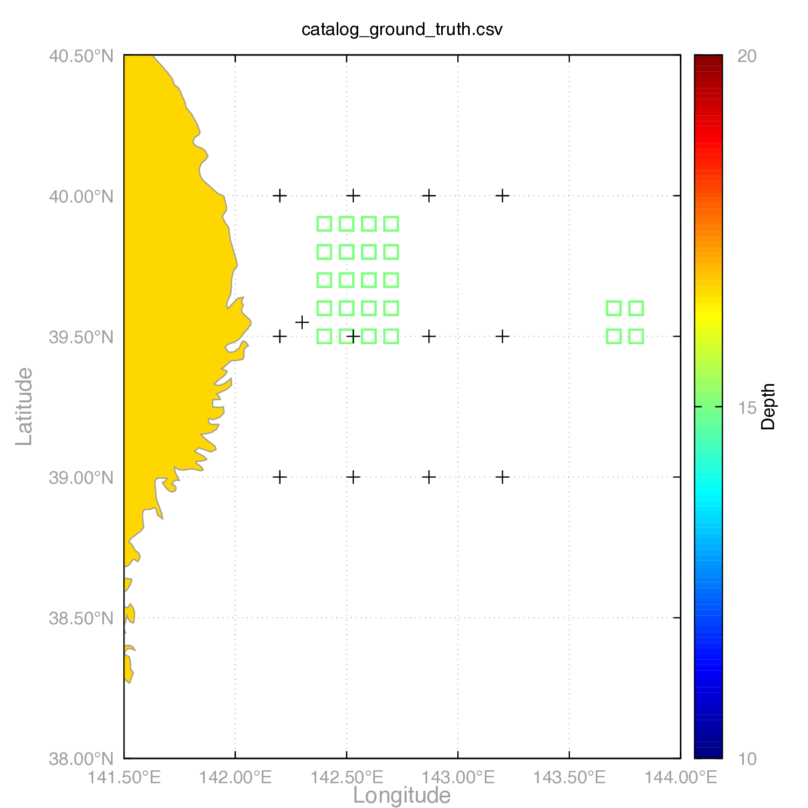
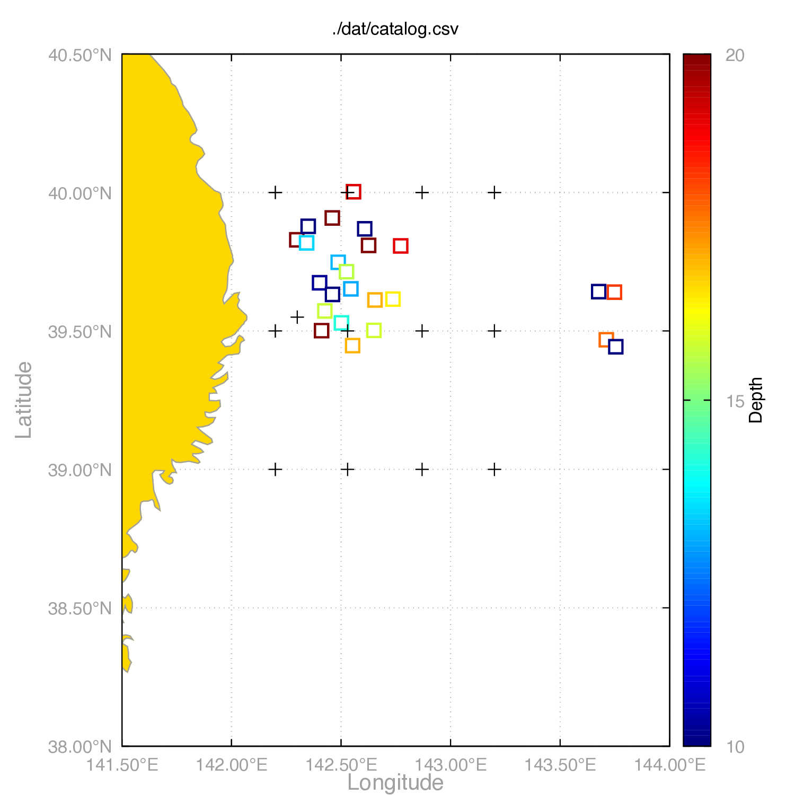
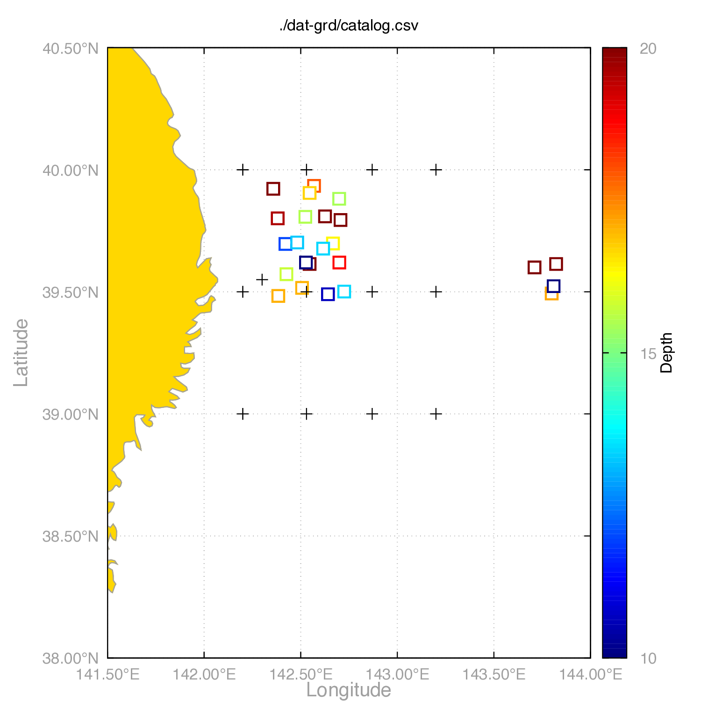
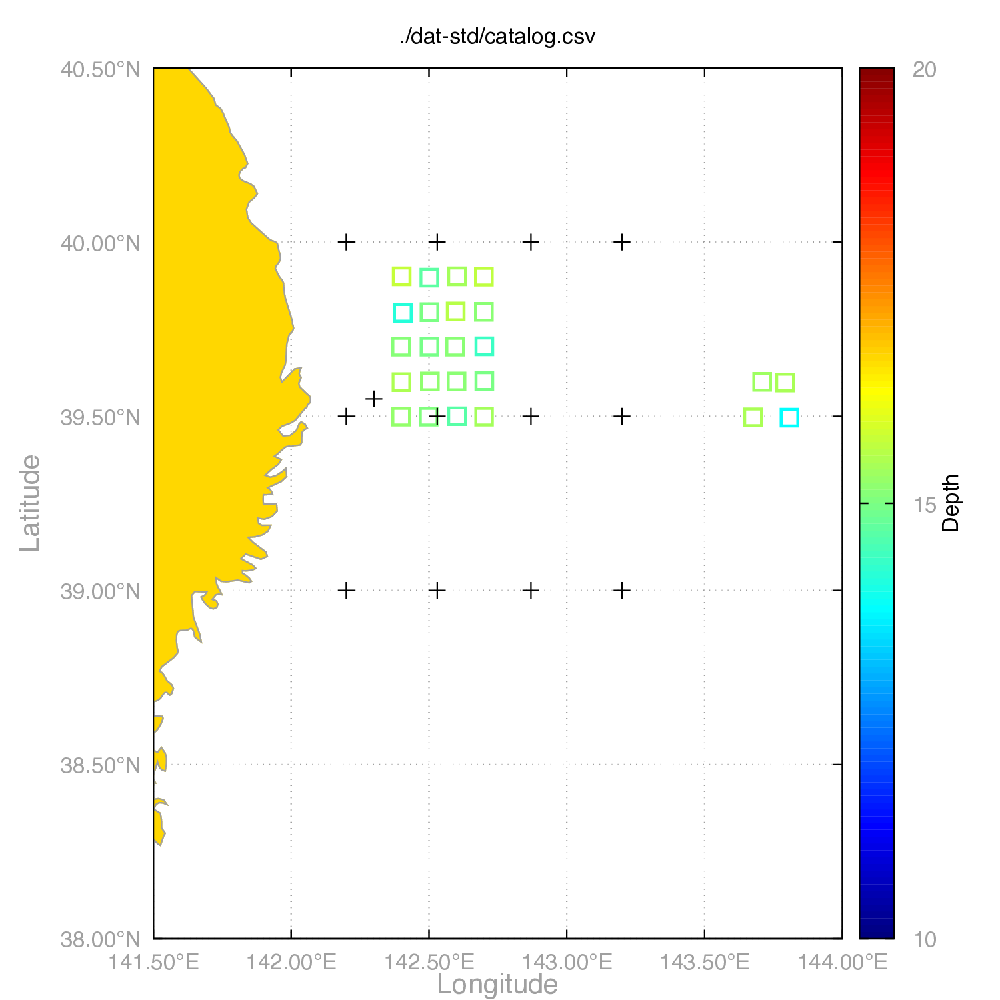
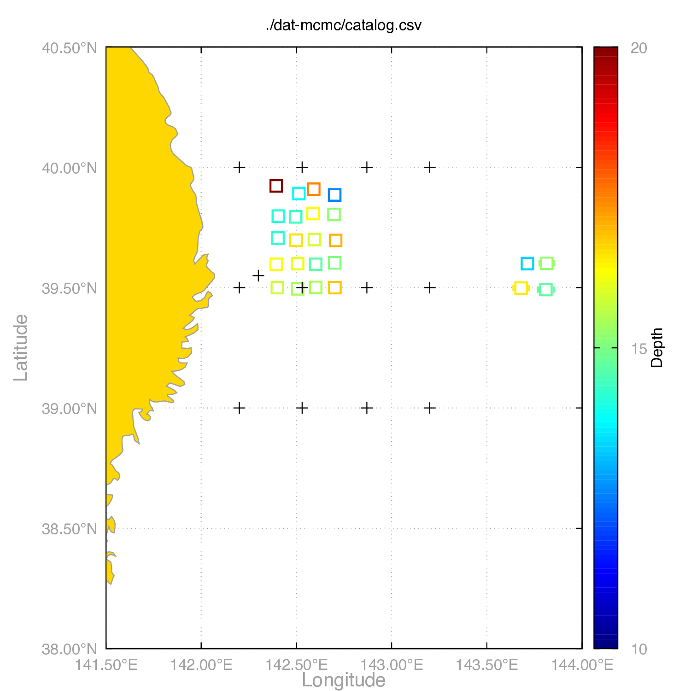
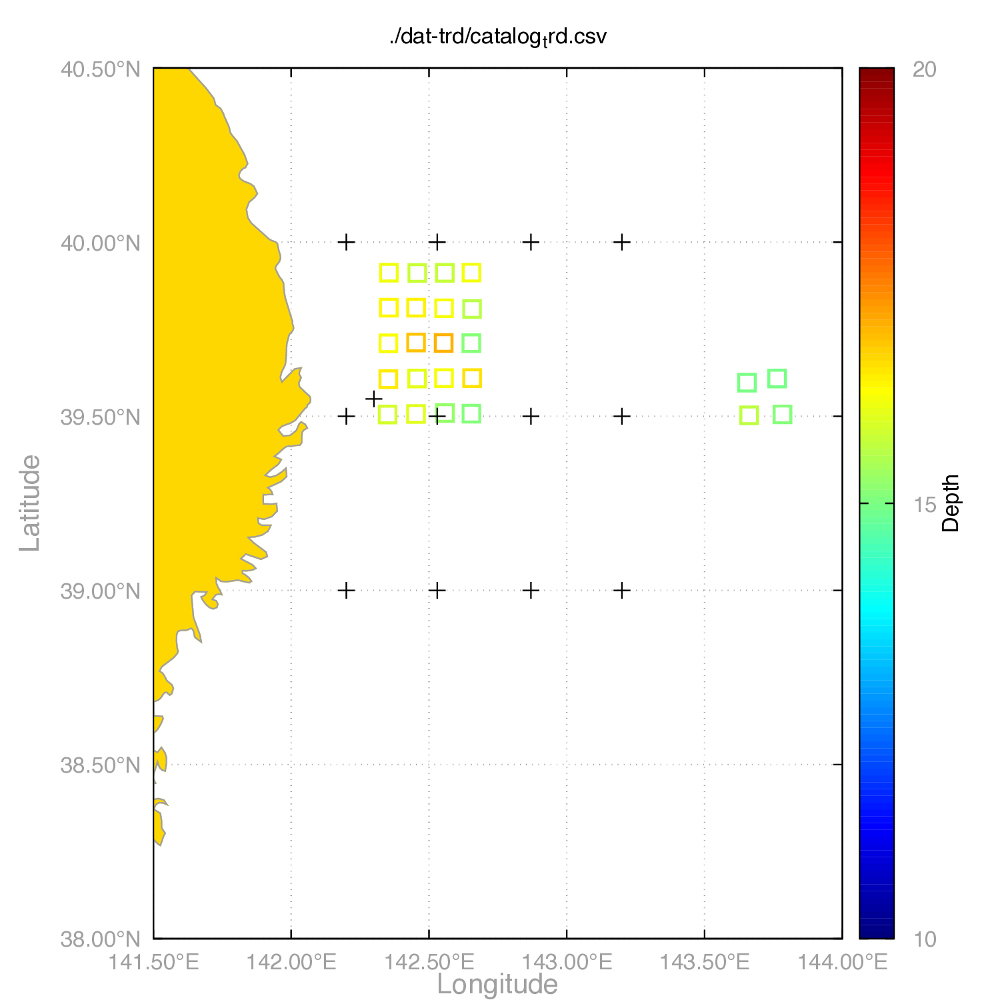
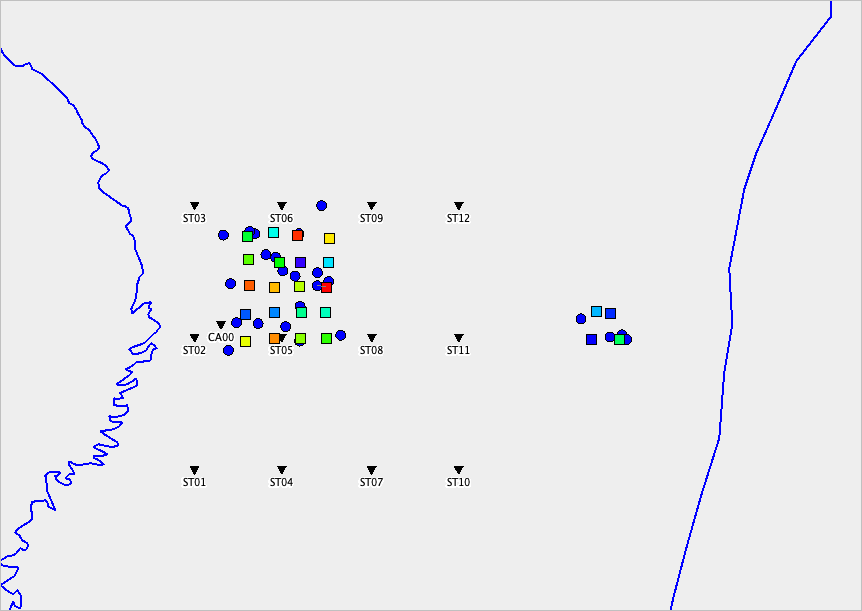

@import "style.css"

# xTreLoc ユーザーマニュアル (日本語版)

## 目次

<!-- @import "[TOC]" {cmd="toc" depthFrom=2 depthTo=3 orderedList=false} -->

<!-- code_chunk_output -->

- [目次](#目次)
- [はじめに](#はじめに)
- [インストールとビルド](#インストールとビルド)
  - [要件](#要件)
  - [ソースからのビルド](#ソースからのビルド)
  - [ビルドの確認](#ビルドの確認)
  - [JARファイルの実行](#jarファイルの実行)
- [データフォーマット](#データフォーマット)
  - [観測点ファイル形式 (station.tbl)](#観測点ファイル形式-stationtbl)
  - [カタログCSV形式](#カタログcsv形式)
  - [走時差データファイル形式](#走時差データファイル形式)
- [GUIモード](#guiモード)
- [CLIモード](#cliモード)
  - [CLIモードの起動](#cliモードの起動)
  - [コマンド構文](#コマンド構文)
  - [利用可能なモード](#利用可能なモード)
  - [ヘルプ](#ヘルプ)
- [デモデータセットチュートリアル](#デモデータセットチュートリアル)
  - [準備](#準備)
  - [デモデータセット構造](#デモデータセット構造)
  - [ワークフロー概要](#ワークフロー概要)
  - [ステップ1: シンセティックデータの生成](#ステップ1-シンセティックデータの生成)
  - [ステップ2: 震源決定](#ステップ2-震源決定)
  - [ステップ3: 震源再決定](#ステップ3-震源再決定)
  - [ステップ4: 結果の可視化](#ステップ4-結果の可視化)
  - [出力結果](#出力結果)
- [引用・データ元](#引用データ元)

<!-- /code_chunk_output -->


---

## はじめに

xTreLocは, 複数の震源決定手法をサポートする震源決定ソフトウェアである: 

- **GRD**: フォーカスドランダムサーチにより, 走時差の残差を最小とするグリッドを返す. 
- **STD**: Station-pair Double Difference法を用いた個々のイベントについての震源決定. Fortranで書かれた`hypoEcc` (Ide, 2010; Ohta et al., 2019) のJavaへの移植版であるが, `delaz4.f`などの軽微なバグを修正済み.
- **MCMC**: マルコフ連鎖モンテカルロ法による震源決定. 不確実性の推定を提供する. 
- **TRD**: Guo & Zhang (2016) によるTriple Difference法を用いた相対震源再決定. 
- **CLS**: 空間クラスタリングによって震源のネットワークを構成し, 走時差についてイベント間の差分を計算する. `hypoDD` (Waldhauser & Ellsworth, 2000) における`ph2dt`と同等の役割であり, TRDモードの前に実行する必要がある. 
- **SYN**: 震源決定モード (GRD, MCMC, STD & TRD) に直接流せるシンセティックデータを作成する. 

本ソフトウェアは2つのモードで使用できる: 

- **GUIモード**: 対話型グラフィカルユーザーインターフェース
- **CLIモード**: バッチ処理用のコマンドラインインターフェース

---

## インストールとビルド

### 要件

- **Java 20以上** (`java -version`で確認)
- オペレーティングシステム: Windows, macOS, またはLinux
- **Gradle** (`gradlew`ラッパーに含まれているか, 別途インストール) または **Maven 3.6以上**

### ソースからのビルド

#### Gradleを使用

```bash
# リポジトリをクローン
git clone https://github.com/KosukeMinamoto/xTreLoc.git
cd xTreLoc

# GUI版をビルド
./gradlew build

# CLI版をビルド
./gradlew cliJar

# 両方をビルド
./gradlew build cliJar
```

ビルドされたJARファイルは`build/libs/`に配置される: 
- `xTreLoc-GUI-1.0-SNAPSHOT.jar` (GUI版)
- `xTreLoc-CLI-1.0-SNAPSHOT.jar` (CLI版)

#### Mavenを使用

```bash
# リポジトリをクローン
git clone https://github.com/KosukeMinamoto/xTreLoc.git
cd xTreLoc

# 両方のJARをビルド
mvn clean package
```

ビルドされたJARファイルは`target/`に配置される: 
- `xTreLoc-GUI-1.0-SNAPSHOT.jar` (GUI版)
- `xTreLoc-CLI-1.0-SNAPSHOT.jar` (CLI版)

**ビルドオプション:**
- GUI版のみビルド: `mvn clean package -Pgui`
- CLI版のみビルド: `mvn clean package -Pcli`

### ビルドの確認

ビルド後, JARファイルが存在することを確認: 

**Gradle:**
```bash
ls -lh build/libs/*.jar
```

**Maven:**
```bash
ls -lh target/*.jar
```

### JARファイルの実行

**GUIモード:**
```bash
# Gradleでビルドした場合
java -jar build/libs/xTreLoc-GUI-1.0-SNAPSHOT.jar

# Mavenでビルドした場合
java -jar target/xTreLoc-GUI-1.0-SNAPSHOT.jar
```

**CLIモード:**
```bash
# Gradleでビルドした場合
java -jar build/libs/xTreLoc-CLI-1.0-SNAPSHOT.jar <MODE> config.json

# Mavenでビルドした場合
java -jar target/xTreLoc-CLI-1.0-SNAPSHOT.jar <MODE> config.json
```

---

## データフォーマット

### 観測点ファイル形式 (station.tbl)

スペース区切り形式: 
```
station,latitude,longitude,depth,Pc,Sc
```

例: 
```
ST01 39.00 142.20 -1000 0.40 0.68
ST02 39.50 142.20 -1670 0.88 1.50
```

**フィールド説明**: 
- **観測点名**: 観測点識別子
- **緯度**: 10進数表記の緯度 (北を正とする)
- **経度**: 10進数表記の経度 (東を正とする)
- **H**: メートル単位の標高 (下向きを正, 海面上は負)
- **Sc**: 理論走時差に足されるP波の観測点補正値 (秒)
- **Pc**: 理論走時差に足されるS波の観測点補正値 (秒)

### カタログCSV形式

ヘッダー付きCSV形式: 
```
time,latitude,longitude,depth,xerr,yerr,zerr,rms,file,mode,cid
```

例: 
```
2000-01-01T00:00:00,39.5000,142.4000,15.0000,0.0000,0.0000,0.0000,0.0000,dat/000101.000000.dat,SYN,0
```

**フィールド説明**: 
- **time**: イベント時刻 (ISO 8601形式, 例: 2000-01-01T00:00:00)
- **latitude**: 10進数表記の緯度 (北を正とする)
- **longitude**: 10進数表記の経度 (東を正とする)
- **depth**: 深さ (km, 下向きを正とする)
- **xerr**: 緯度方向の決定誤差 (km)
- **yerr**: 経度方向の決定誤差 (km)
- **zerr**: 深さ方向の決定誤差 (km)
- **rms**: RMS走時差残差 (秒)
- **file**: 対応する`.dat`ファイルのパス
- **mode**: イベント種別 (SYN, GRD, STD, MCMC, TRD, ERR, REF)
- **cid**: クラスタID (整数, 0はクラスタに分類されないイベント)

**イベント種別**: 
- **SYN**: SYNモードで生成されたイベント
- **GRD**: GRDモードで決定されたイベント
- **STD**: STDモードで決定されたイベント
- **TRD**: TRDモードで再決定されたイベント
- **ERR**: 震源決定中にエラーが生じたイベント (例: airquake)
- **REF**: CLSモードとTRDモードにおいてのみ参照され, リファレンスとして固定されるイベント

### 走時差データファイル形式

イベントごとの震源, 走時差を管理するスペース区切りのファイル. 

**形式**: 
- **1行目**: `緯度 経度 深さ 決定されたモード`
- **2行目**: `緯度誤差 経度誤差 深さ誤差 RMS走時差残差`
- **3行目以降**: `観測点1 観測点2 走時差 走時差残差`
 
**例**: 
```
39.476 142.367 14.015 SYN
0.030 0.030 3.340 -999.000
ST07 ST09 -0.889 1.000
ST03 CA00 -12.975 1.000
ST02 ST09 12.280 1.000
```

**フィールド説明**: 
- **走時差**: S波についての走時差. 観測点st1とst2における到達時刻T_st1とT_st2について, T_st2 - T_st1の値に対応する. 
- **重み**: データ品質の重み. `config.json`内の`threshold`と比較され, その検測値を使用するか判断する際に参照される. 例えば, 相互相関関数の最大値を入力することで, `threshold: 0.6`とした場合にはCC>0.6の検測値のみを用いて震源を決定する. 
SYNモードにおいては全て1.0が設定され, GRD, STD, MCMCモードにおいては走時差の逆数の絶対値が書き込まれる. 例えば残差が-2秒の検測値の重みは`0.5`であり, 次の決定ステップ (STD, MCMC, CLS, TRD)において許容する残差を`threshold`で管理できる. なおSTDモードにおいては優決定問題として解くため, `threshold`を超える4つ以上の検測値がない場合にはエラーが出力される. 

---

## GUIモード

GUIは3つの主要なタブで構成される:
1. Solverタブ: 震源決定計算の設定と実行. 
2. Viewerタブ: 震源位置の可視化と結果の分析. 
3. Settingsタブ: アプリケーション設定の構成. 

以下のコマンドで起動:

```bash
java -jar build/libs/xTreLoc-GUI-1.0-SNAPSHOT.jar
```

またはGradleを使用: 

```bash
./gradlew run
```

---

## CLIモード

### CLIモードの起動

```bash
java -jar xTreLoc-CLI-1.0-SNAPSHOT.jar <MODE> [config.json]
```

またはGradleを使用: 

```bash
./gradlew runCLI -PcliArgs="<MODE> [config.json]"
```

### コマンド構文

```
java -jar xTreLoc-CLI-1.0-SNAPSHOT.jar <MODE> [config.json]
```

- `<MODE>`: GRD, STD, MCMC, TRD, CLS, またはSYNのいずれか
- `[config.json]`: 設定ファイルのパス (Default:`config.json`)

### 利用可能なモード

各震源決定モードには, 大まかには以下のような特徴がある:
- **GRDモード**: 中程度の速度だが, 大まかな分布の推定や初期震源決定に適する.
- **STDモード**: 高速に良好な精度を出すが, 初期値依存性が高いため, GRDモードの次に実行することが推奨される.
- **MCMCモード**: 計算に時間を要するが, 良好な決定精度. 
- **TRDモード**: インプットデータの震源決定精度が大きく影響するため, 上記のモードを実行後の再決定手法として用いられる. また一部の解は発散するためにデータ数が減る場合が多い. なお計算が重いため, ブートストラップ法を用いた誤差推定は現時点で未実装. 

#### GRDモード (グリッドサーチ)

```bash
java -jar xTreLoc-CLI-1.0-SNAPSHOT.jar GRD config.json
```

指定されたディレクトリ内のすべての`.dat`ファイルに対して, フォーカスドランダムサーチを使用したグリッドサーチ震源決定を実行. 

#### STDモード

```bash
java -jar xTreLoc-CLI-1.0-SNAPSHOT.jar STD config.json
```

すべての`.dat`ファイルに対してStation-pair Double Difference法を適用.

#### MCMCモード

```bash
java -jar xTreLoc-CLI-1.0-SNAPSHOT.jar MCMC config.json
```

すべての`.dat`ファイルに対してMCMCを用いた震源決定を実行. 

#### CLSモード

```bash
java -jar xTreLoc-CLI-1.0-SNAPSHOT.jar CLS config.json
```

DBSCANアルゴリズムを使用して, カタログファイルに対して空間クラスタリングを実行し, 「走時差の差」データをバイナリ形式で作成. `hypoDD`の`ph2dt`と同等の機能. 

#### TRDモード

```bash
java -jar xTreLoc-CLI-1.0-SNAPSHOT.jar TRD config.json
```

Guo & Zhang (2016) の方法を使用して, カタログファイルに対してTriple-Difference法を実行. CLSモードによるバイナリファイルが必要.

#### SYNモード

```bash
java -jar xTreLoc-CLI-1.0-SNAPSHOT.jar SYN config.json
```

正解値カタログからdat形式のシンセティックデータを生成. 

### ヘルプ

```bash
java -jar xTreLoc-CLI-1.0-SNAPSHOT.jar --help
```

または

```bash
java -jar xTreLoc-CLI-1.0-SNAPSHOT.jar
```

---

## デモデータセットチュートリアル

このチュートリアルでは, `demo/`ディレクトリ内のサンプルデータを使用してxTreLocを使用する手順を説明する.

**重要**: このチュートリアルのすべてのコマンドは, プロジェクトルートディレクトリ（`demo/`フォルダを含むディレクトリ）から実行する必要がある. `config.json`内のパスはこのディレクトリを基準とした相対パス, つまりコマンドを実行する際のカレントディレクトリは, プロジェクトルート（`demo/`の1つ上のディレクトリ）である必要がある.

### 準備

- Java 20以上がインストールされていること
- xTreLoc JARファイルがビルドされていること (GUIおよび/またはCLI)
- **カレントディレクトリ**: プロジェクトルートディレクトリ（`demo/`, `config.json`などを含むディレクトリ）にいることを確認してください
- `demo/`ディレクトリ内のサンプルデータ: 
  - `catalog_ground_truth.csv`: 正解値カタログ
  - `station.tbl`: 観測点ファイル
- Gnuplot (可視化スクリプト用, オプショナル)

- 以下の`config.json`が必要 (CLIモードで実行する場合)
  ```json
  {
      "logLevel": "INFO",
      "numJobs": 4,
      "stationFile": "./demo/station.tbl",
      "taupFile": "prem",
      "hypBottom": 40.0,
      "threshold": 0.0,
      "modes": {
          "GRD": {
              "datDirectory": "./demo/dat",
              "outDirectory": "./demo/dat-grd"
          },
          "STD": {
              "datDirectory": "./demo/dat",
              "outDirectory": "./demo/dat-std"
          },
          "MCMC": {
              "datDirectory": "./demo/dat",
              "outDirectory": "./demo/dat-mcmc"
          },
          "TRD": {
              "catalogFile": "./demo/dat-cls/catalog.csv",
              "datDirectory": "./demo/dat-cls",
              "outDirectory": "./demo/dat-trd"
          },
          "CLS": {
              "catalogFile": "./demo/dat-cls/catalog.csv",
              "outDirectory": "./demo/dat-cls",
              "minPts": 5,
              "eps": 10.0
          },
          "SYN": {
              "catalogFile": "./demo/catalog_ground_truth.csv",
              "outDirectory": "./demo/dat",
              "randomSeed": 200,
              "phsErr": 0.15,
              "locErr": 0.05,
              "minSelectRate": 0.3,
              "maxSelectRate": 0.5
          }
      },
      "solver": {
          "GRD": {
              "totalGrids": 300,
              "numFocus": 3
          },
          "MCMC": {
              "nSamples": 1000,
              "burnIn": 200,
              "stepSize": 0.1,
              "temperature": 1.0
          },
          "TRD": {
              "iterNum": [10, 10],
              "distKm": [50, 20],
              "dampFact": [0, 1]
          }
      }
  }
  ```

### デモデータセット構造

```sh
mkdir -p ./demo/dat
```

```
.
├── config.json                    # CLIモードでのみ使用
└── demo/
    ├── catalog_ground_truth.csv   # SYNモード用の正解値カタログ
    ├── station.tbl                # 観測点ファイル
    ├── map_njt.plt                # 描画用のGnuplot Script
    ├── map_njt.m                  # 描画用のMatlab Script
    └── dat/                       # 入力.datファイル
```

### ワークフロー概要

```
ステップ1: SYN → .datファイルの生成
  ↓
ステップ2: GRD+STD or MCMCによる震源決定手法の実行 → catalog.csvの出力
  ↓
ステップ3: 可視化 → Gnuplot/Matlab/PythonまたはGUI
  ↓
ステップ4: CLS → クラスタ化されたcatalog.csv, 走時差の差データ (triple_diff_*.bin)
  ↓
ステップ5: TRD
```

### ステップ1: シンセティックデータの生成

**目的**: 正解値カタログからシンセティック走時差データを作成. 

**GUIを使用**: 
1. アプリケーションを起動: `java -jar build/libs/xTreLoc-GUI-1.0-SNAPSHOT.jar`
2. "solver"タブに移動
3. モードを選択: **SYN**
4. 設定: 
   - **カタログファイル**: `./demo/catalog_ground_truth.csv`
   - **出力ディレクトリ**: `./demo/dat`
   - **パラメータ**: 
     - Random seed: シード値 (Default: 100)
     - Phase error (phsErr): 走時差に与えられるパータベーション (秒) (Default: 0.1)
     - Location error (locErr): 震源位置に与えられるパータベーション (deg) (Default: 0.03)
     - Minimum selection rate: 選択される<u>最小</u>の走時差データ数 (Default: 0.2)
     - Maximum selection rate: 選択される<u>最大</u>の走時差データ数 (Default: 0.4)
   なお, `phsErr`, `locErr`の値はガウス分布の標準偏差に対応. 最大/最小選択率は考えうる観測点ペア (nC2, nは観測点数) から, どの割合の走時差データを用いるかを決定. 
5. "▶ Execute"をクリック

**CLIを使用**: 

```bash
java -jar build/libs/xTreLoc-CLI-1.0-SNAPSHOT.jar SYN config.json
```

- `phsErr`: 走時差に与えるパータベーション (Default: 0.1秒)
- `locErr`: 震源に与えるパータベーション (Default: 水平0.03度, 深さ3km)
- `minSelectRate, maxSelectRate`: ランダムに選定される検測の数の幅 (Default: 20-40%)

### ステップ2: 震源決定

#### オプションA: GRD & STD

フォーカスドランダムサーチののち, STD法を使用して震源位置を決定. 

**GUIを使用**: 
1. モードを選択: **GRD**
1. 設定: 
   - **入力ディレクトリ**: `./demo/dat`
   - **出力ディレクトリ**: `./demo/dat-grd` (事前に存在している必要がある)
   - **パラメータ**: 
     - Parallelization (numJobs): 並列化計算におけるジョブ数 (>1)
     - Weight Threshold (threshold): weight値のスクリーニング (0であれば全ての走時データを用いる)
     - Maximum Depth: 探索される深さの限界. 一方で, 浅さの限界は最も深い観測点の深さ. 
     - Total Grids: 探索するグリッドの総数 (Default: 300)
     - Focus Grids: 領域を狭めるステップ数 (Default: 3)
     例えば上記の例では100 (=300/3) グリッドずつ, 対象範囲を狭めながら3回に渡ってランダムに設置して探索する (つまり, 観測点範囲を囲む領域に100グリッドをばら撒き, 残差が最小となる点 $p_1$ を特定. 次に $p_1$ の周辺に100点ばら撒き, 最良の点 $p_2$ を特定. さらに同様に $p_2$ の周辺のより細かい領域に100点を選び, 最も良い $p_3$ を解とする.)
1. "▶ Execute"をクリック
1. モードを選択: **STD**
1. 設定: 
   - **入力ディレクトリ**: `./demo/dat-grd`
   - **出力ディレクトリ**: `./demo/dat-std` (事前に存在している必要がある)
   - **パラメータ**: 
     - Parallelization (numJobs): 並列化計算におけるジョブ数 (>1)
     - Weight Threshold (threshold): weight値のスクリーニング (0であれば全ての走時データを用いる)
　    - Maximum Depth: 探索される深さの限界. 一方で, 浅さの限界は最も深い観測点の深さ. 
     - LM Initial Step Bound (initialStepBoundFactor)	100	
     - LM Cost Relative Tolerance (costRelativeTolerance)	1e-6	
     - LM Parameter Relative Tolerance (parRelativeTolerance)	1e-6	
     - LM Orthogonal Tolerance (orthoTolerance)	1e-6	
     - LM Max Evaluations (maxEvaluations)	1000	
     - LM Max Iterations (maxIterations)	1000
     LM法に関するパラメータの変更は基本的に非推奨. 

1. "▶ Execute"をクリック

**CLIを使用**: 
```bash
mkdir -p demo/dat-grd
java -jar build/libs/xTreLoc-CLI-1.0-SNAPSHOT.jar GRD config.json
mkdir -p demo/dat-std
java -jar build/libs/xTreLoc-CLI-1.0-SNAPSHOT.jar STD config.json
```

#### オプションB: MCMC

マルコフ連鎖モンテカルロ手法を使用して震源位置を決定.

**GUIを使用**: 
1. モードを選択: **MCMC**
2. 設定: 
   - **入力ディレクトリ**: `./demo/dat`
   - **出力ディレクトリ**: `./demo/dat-mcmc` (事前に存在している必要がある)
   - **パラメータ**: 
     - Parallelization (numJobs): 並列化計算におけるジョブ数 (>1)
     - Weight Threshold (threshold): weight値のスクリーニング (0であれば全ての走時データを用いる)
     - Maximum Depth: 探索される深さの限界. 一方で, 浅さの限界は最も深い観測点の深さ. 
     - Sample Count: サンプル数 (Default: 1000)
     - Burn-in Period: バーンイン (Default: 200)
     - Step Size: ステップサイズ (Default: 0.1)
     - Depth Step Size: 深さ方向のステップサイズ (Default: 1.0)
     - Temperature Parameter: (Default: 1.0)
3. "▶ Execute"をクリック

**CLIを使用**: 

```bash
mkdir -p ./demo/dat-mcmc
java -jar build/libs/xTreLoc-CLI-1.0-SNAPSHOT.jar MCMC config.json
```

### ステップ3: 震源再決定

CLSモードによるクラスタリングと, 震源ペア間における走時差の差データを計算. この例では精度検証のためにSYNモードで生成された`dat`以下のファイルを用いるが, 一般的にはステップ2で決定されたGRD＆STD or MCMCによる震源をインプットすることが強く推奨される. 

**GUIを使用**: 
1. モードを選択: **CLS**
2. 設定: 
   - **カタログファイル**: `./demo/dat/catalog.csv` (または`dat-std`, `dat-mcmc`)
   - **出力ディレクトリ**: `./demo/dat-cls` (事前に存在している必要がある)
   - **パラメータ**: 
     - Minimum points: クラスタあたりの最小ポイント数 (3)
     - Epsilon (km): クラスタ半径 (30.0)
     - Weight Threshold (threshold): weight値のスクリーニング
     - Data Inclusion Rate (オプショナル): イプシロンの値が負の場合にはK-distance graphを用いた自動推定が行われる. その際に, 全体のイベント数に対して何割のイベントを含むようにイプシロンを設定するかを入力する. 未設定の場合にはエルボー法により自動推定される. 
     - RMS Threshold (オプショナル):  datファイルにおける走時差に対する閾値 (秒). これ以上の走時残差を持つイベントはクラスタリングに用いられない. 
     - Location Error Threshold (オプショナル): datファイルにおける水平方向の震源決定精度に対する閾値 (km). これ以上のエラーを持つイベントは, クラスタリングに用いられない.

3. "▶ Execute"をクリック

**K-Distanceグラフ** (イプシロン推定用): 


**CLIを使用**: 
```bash
java -jar build/libs/xTreLoc-CLI-1.0-SNAPSHOT.jar CLS config.json
```

**注意**: クラスタIDは1から始まる連番であり, 0はクラスタに分類されないイベントに対応する. なお, カタログファイルの11列目 (cid) に整数値が記載されている場合にはそのクラスタIDが使用される (走時差の差データの計算のみが実行されるため, 事前に別手法でクラスタリングを行う場合に用いられる). クラスタ番号が付与されず, 該当列が空白の場合には`minPts`と`eps`をパラメータとするDBSCANクラスタリングが実行される. ただし, `eps`が負の場合にはk-distance graph (に加え, Data Inclusion Rateが未指定の場合にはエルボー法) によって自動推定された`eps`によりクラスタリングされる. 
CLSモードはhypoDDにおける`dt.ct`に対応するファイルである`triple_diff_<cid>.bin`（バイナリ形式）を出力する. これを用いて相対震源決定を行う. 

**GUIを使用**: 
1. モードを選択: **TRD**
2. 設定: 
   - **カタログファイル**: `./demo/dat-cls/catalog.csv` (または他のカタログ)
   - **入力ディレクトリ**: `./demo/dat-cls` (triple differenceバイナリファイルを含むディレクトリ)
   - **出力ディレクトリ**: `./demo/dat-trd` (事前に存在している必要がある)
   - **パラメータ**: 
     - Parallelization (numJobs): 並列化計算におけるジョブ数 (>1)	
     - Weight Threshold (threshold): weight値のスクリーニング (0であれば全ての走時データを用いる)
     - Maximum Depth: 探索される深さの限界. 一方で, 浅さの限界は最も深い観測点の深さ. <u>GRD, STD, MCMCモードとは異なり, これ以深 (または観測点よりも浅い) に更新された場合には決定不良と判断され, Errタグが付与される.</u>
     - Iteration Count (iterNum): 各ステップにおけるイタレーション回数 (e.g., 10,10)
     - Distance Threshold (distKm): 各ステップにおけるイベント間距離の制限 (e.g., 50,20)
     - Damping Factor (dampFact): 各ステップにおけるダンピング係数 (e.g., 0,1)
     Iteration Count, Distance Threshold, Damp. Factorの与え方はリストで与える必要がある. 上記の例では, 最初のステップでは50 km以内にあるイベントでネットワークを構成して, Damp. Factorを0として10回イタレーションする. さらに次のステップでは同様に, 20 kmのイベントに対してDamp. Factor=1で10回イタレーションする. そのため, これらのリストの個数は同数である必要がある. 
     カタログファイルにおいて, ラベルがREFであるイベントの震源は更新されず, 固定される.

3. "▶ Execute"をクリック

**CLIを使用**: 
```bash
mkdir -p demo/dat-trd
java -jar build/libs/xTreLoc-CLI-1.0-SNAPSHOT.jar TRD config.json
```

### ステップ4: 結果の可視化

#### Gnuplot

提供されたGnuplotスクリプト`map_njt.plt`を使用して, カタログ結果の簡易的な可視化が可能.  

**使用方法**: 
1. `demo/`ディレクトリに移動: 
   ```bash
   cd demo
   ```
2. `map_njt.plt`を編集し, `filename_csv`変数をカタログファイルに設定: 
   ```gnuplot
   filename_csv = "dat-std/catalog.csv"
   ```
3. gnuplotを実行: 
   ```bash
   gnuplot map_njt.plt
   ```
4. PDFが自動的に生成される. 

**例の出力**: 
- 正解値: 

- パータベーションされた震源: 

- GRD結果: 

- GRD&STD結果: 

- MCMC結果: 

- TRD結果: 

#### MATLAB

提供されたMATLABスクリプト`map_njt.m`を使用してもマップを作成できる. 

**使用方法**: 
1. `map_njt.m`を編集し, カタログファイルを設定: 
   ```matlab
   catalog_file = "demo/dat-std/catalog.csv";
   ```
1. MATLABを実行: 
   ```matlab
   map_njt
   ```

**例の出力**: 

#### GUI上での描画

"viewer"タブに移動し, "Catalogデータ"タブで, "ファイル選択"をクリックしてカタログファイルを読み込むことで描画可能. shpファイルなどを選択することで, 海岸線や海溝も描画可能. 

**GUI可視化例**: 


### 出力結果

すべてのステップを完了すると, 以下が得られる: 

```
demo
├── catalog_ground_truth.csv
├── dat
│   ├── 000101.000000.dat
│   ├── 000101.010000.dat
│   ├── ...
│   └── catalog.csv
├── dat-cls
│   ├── 000101.000000.dat
│   ├── 000101.010000.dat
│   ├── ...
│   ├── catalog.csv
│   ├── triple_diff_1.bin
│   └── triple_diff_2.bin
├── dat-grd
│   ├── 000101.000000.dat
│   ├── 000101.010000.dat
│   ├── ...
│   └── catalog.csv
├── dat-mcmc
│   ├── 000101.000000.dat
│   ├── 000101.010000.dat
│   ├── ...
│   └── catalog.csv
├── dat-std
│   ├── 000101.000000.dat
│   ├── 000101.010000.dat
│   ├── ...
│   └── catalog.csv
├── dat-trd
│   ├── 000101.000000.dat
│   ├── 000101.010000.dat
│   ├── ...
│   └── catalog_trd.csv
├── map_njt.m
├── map_njt.plt
└── station.tbl
```

---

<!-- 
### 共通パラメータ

- **logLevel**: ログレベル ("INFO", "DEBUG", "WARNING", "SEVERE")
- **numJobs**: 並列ジョブ数 (1以上)
- **stationFile**: 観測点ファイルのパス
- **taupFile**: TauP速度モデル ("prem", "iasp91", "ak135", "ak135f", またはファイルパス)
- **hypBottom**: 最大震源深さ (km)
- **threshold**: データ品質フィルタリング用の閾値 -->

<!-- ### モード固有パラメータ

#### GRDモード
- **datDirectory**: 入力`.dat`ファイルを含むディレクトリ
- **outDirectory**: 結果の出力ディレクトリ (事前に存在している必要がある)
- **totalGrids**: 総グリッドポイント数
- **numFocus**: 精緻化するフォーカスポイント数

#### STDモード
- **datDirectory**: 入力`.dat`ファイルを含むディレクトリ
- **outDirectory**: 結果の出力ディレクトリ (事前に存在している必要がある)

#### MCMCモード
- **datDirectory**: 入力`.dat`ファイルを含むディレクトリ
- **outDirectory**: 結果の出力ディレクトリ (事前に存在している必要がある)
- **nSamples**: MCMCサンプル数
- **burnIn**: バーンインサンプル数
- **stepSize**: MCMCウォークのステップサイズ
- **temperature**: 温度パラメータ

#### TRDモード
- **catalogFile**: 入力カタログCSVファイル
- **outDirectory**: 結果の出力ディレクトリ (事前に存在している必要がある)
- **iterNum**: 各段階の反復回数の配列
- **distKm**: 各段階の距離閾値 (km)の配列
- **dampFact**: 各段階のダンピング係数の配列

#### CLSモード
- **catalogFile**: 入力カタログCSVファイル
- **outDirectory**: 結果の出力ディレクトリ (事前に存在している必要がある)
- **minPts**: クラスタの最小ポイント数
- **eps**: クラスタリング用のイプシロン距離 (km, 自動推定の場合は負の値)
- **epsPercentile**: 自動イプシロンのパーセンタイル (0-1, オプション)
- **rmsThreshold**: フィルタリング用のRMS閾値 (オプション)
- **locErrThreshold**: フィルタリング用の位置誤差閾値 (オプション)

#### SYNモード
- **catalogFile**: 正解値カタログCSVファイル
- **outDirectory**: 生成された`.dat`ファイルの出力ディレクトリ (事前に存在している必要がある)
- **randomSeed**: 再現性のためのランダムシード
- **phsErr**: 位相誤差標準偏差 (秒)
- **locErr**: 位置誤差標準偏差 (水平方向は度, 深さはkm)
- **minSelectRate**: 最小観測点選択率 (0-1)
- **maxSelectRate**: 最大観測点選択率 (0-1)
 -->

## 引用・データ元

1. Natural Earth: https://www.naturalearthdata.com/downloads/10m-physical-vectors/10m-coastline/
1. The Geospatial Information Authority of Japan (GSI): https://www.gsi.go.jp/kankyochiri/gm_japan_e.html

---

**バージョン**: 1.0-SNAPSHOT  
**最終更新**: 2024

